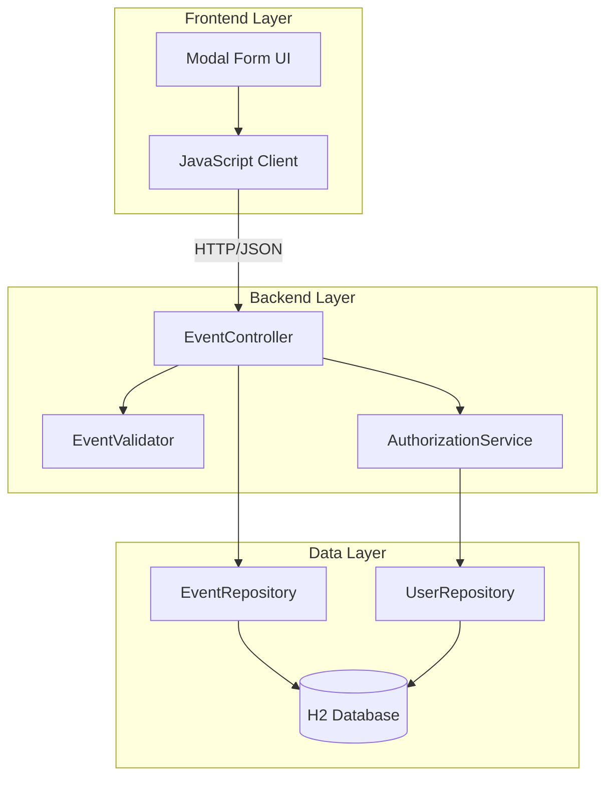
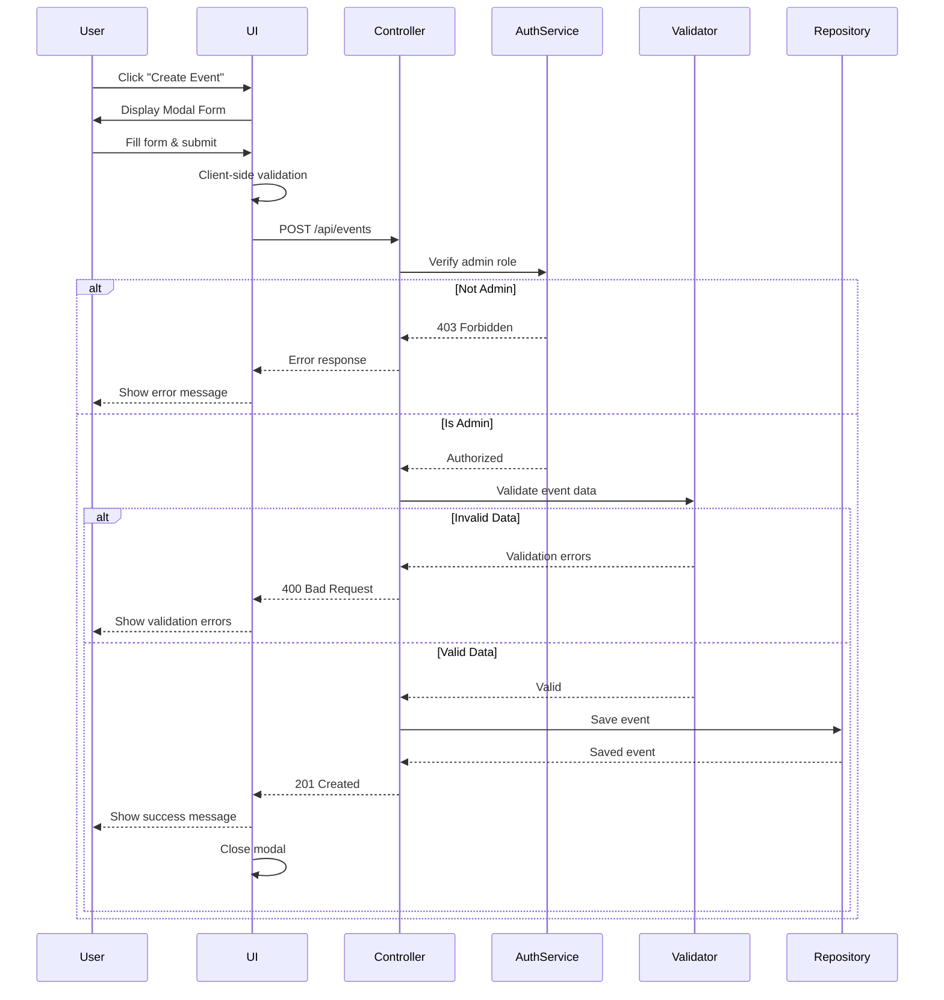

# Design Document: Admin Event Creation and Update

## Overview

This design document specifies the technical implementation for enhancing the College Event Management System with comprehensive admin event management capabilities. The feature enables administrators to create, update, and delete events through both REST API endpoints and a user-friendly modal form interface.

### Goals

- Implement role-based authorization for event management operations
- Provide comprehensive input validation for event data
- Create a responsive modal UI for event creation
- Ensure data integrity and consistency across operations
- Deliver clear error feedback to users and API consumers

### Non-Goals

- Implementing Spring Security (will use custom authorization logic)
- Event approval workflows
- Bulk event operations
- Event scheduling/calendar integration
- Advanced image upload/management (only URL storage)

## Architecture

### System Components

The system follows a three-tier architecture:



### Component Responsibilities

**Frontend Components:**
- **Modal Form UI**: Renders event creation/update form, handles user input, displays validation feedback
- **JavaScript Client**: Manages HTTP requests, authentication token handling, response processing

**Backend Components:**
- **EventController**: Handles HTTP requests, orchestrates validation and authorization, manages responses
- **EventValidator**: Validates event data against business rules
- **AuthorizationService**: Verifies user roles and permissions

**Data Components:**
- **EventRepository**: Provides CRUD operations for Event entities
- **UserRepository**: Provides user lookup for authorization
- **H2 Database**: Persists event and user data

### Request Flow

**Event Creation Flow:**


## Components and Interfaces

### Backend API Endpoints

#### 1. Create Event
```
POST /api/events
Authorization: Required (Admin role)
Content-Type: application/json

Request Body:
{
  "title": "string (required)",
  "date": "string (required)",
  "location": "string (required)",
  "category": "string (required)",
  "description": "string (optional)",
  "registrationFee": "number (optional, default: 100.0, must be >= 0)",
  "imageUrl": "string (optional)"
}

Response 201 Created:
{
  "id": "number",
  "title": "string",
  "date": "string",
  "location": "string",
  "category": "string",
  "description": "string",
  "registrationFee": "number",
  "imageUrl": "string"
}

Response 400 Bad Request:
{
  "error": "Validation failed",
  "field": "string",
  "message": "string"
}

Response 401 Unauthorized:
{
  "error": "Authentication required",
  "message": "string"
}

Response 403 Forbidden:
{
  "error": "Authorization failed",
  "message": "Admin role required"
}
```

#### 2. Update Event
```
PUT /api/events/{id}
Authorization: Required (Admin role)
Content-Type: application/json

Request Body: (same as Create Event)

Response 200 OK: (same structure as Create Event response)
Response 400 Bad Request: (same as Create Event)
Response 401 Unauthorized: (same as Create Event)
Response 403 Forbidden: (same as Create Event)
Response 404 Not Found:
{
  "error": "Event not found",
  "message": "Event with id {id} does not exist"
}
```

#### 3. Delete Event
```
DELETE /api/events/{id}
Authorization: Required (Admin role)

Response 204 No Content: (empty body)
Response 401 Unauthorized: (same as Create Event)
Response 403 Forbidden: (same as Create Event)
Response 404 Not Found: (same as Update Event)
```

#### 4. Get All Events
```
GET /api/events
Authorization: Optional (public access)

Response 200 OK:
[
  {
    "id": "number",
    "title": "string",
    "date": "string",
    "location": "string",
    "category": "string",
    "description": "string",
    "registrationFee": "number",
    "imageUrl": "string"
  }
]
```

### Frontend Components

#### Event Creation Modal

**HTML Structure:**
```html
<div id="eventModal" class="modal">
  <div class="modal-content">
    <div class="modal-header">
      <h2>Create Event</h2>
      <button class="close-btn">&times;</button>
    </div>
    <form id="eventForm">
      <input type="text" name="title" placeholder="Event Title" required>
      <input type="date" name="date" required>
      <input type="time" name="time" required>
      <input type="text" name="location" placeholder="Location" required>
      <textarea name="description" placeholder="Description"></textarea>
      <input type="text" name="category" placeholder="Category" required>
      <input type="number" name="registrationFee" placeholder="Registration Fee (default: 100.0)" min="0" step="0.01">
      <input type="url" name="imageUrl" placeholder="Image URL">
      <div class="form-actions">
        <button type="button" class="cancel-btn">Cancel</button>
        <button type="submit" class="submit-btn">Create Event</button>
      </div>
    </form>
    <div id="formMessage" class="message"></div>
  </div>
</div>
```

**JavaScript Interface:**
```javascript
class EventModal {
  constructor();
  open();                          // Display modal
  close();                         // Hide modal
  submitForm(formData);            // Submit event data to API
  showSuccess(message);            // Display success feedback
  showError(message);              // Display error feedback
  validateForm();                  // Client-side validation
  clearForm();                     // Reset form fields
}
```

## Data Models

### Event Entity

```java
@Entity
public class Event {
    @Id
    @GeneratedValue(strategy = GenerationType.IDENTITY)
    private Long id;
    
    @NotBlank(message = "Title is required")
    private String title;
    
    @NotBlank(message = "Date is required")
    private String date;
    
    @NotBlank(message = "Location is required")
    private String location;
    
    @NotBlank(message = "Category is required")
    private String category;
    
    private String description;
    
    @Min(value = 0, message = "Registration fee must be non-negative")
    private Double registrationFee = 100.0;
    
    private String imageUrl;
    
    // Getters and setters
}
```

### Validation Rules

| Field | Required | Type | Constraints |
|-------|----------|------|-------------|
| id | Auto-generated | Long | Read-only, preserved on update |
| title | Yes | String | Not null, not blank |
| date | Yes | String | Not null, not blank |
| location | Yes | String | Not null, not blank |
| category | Yes | String | Not null, not blank, any string value accepted |
| description | No | String | Optional |
| registrationFee | No | Double | >= 0, default: 100.0 |
| imageUrl | No | String | Optional, URL format recommended but not enforced |

### Error Response Model

```java
public class ErrorResponse {
    private String error;      // Error type/category
    private String message;    // Human-readable description
    private String field;      // Field name (for validation errors)
    private int status;        // HTTP status code
    
    // Constructors, getters, setters
}
```

## Security and Authorization

### Authorization Strategy

Since the system does not use Spring Security, authorization will be implemented through custom logic:

**Authorization Service:**
```java
@Service
public class AuthorizationService {
    @Autowired
    private UserRepository userRepository;
    
    public User validateAdminUser(String authToken) {
        // Extract user identifier from token (e.g., email or user ID)
        // Look up user in database
        // Verify role is "Admin"
        // Return user if valid, throw exception otherwise
    }
    
    public User validateAuthenticatedUser(String authToken) {
        // Extract user identifier from token
        // Look up user in database
        // Return user if exists, throw exception otherwise
    }
}
```

**Controller Integration:**
```java
@RestController
@RequestMapping("/api/events")
public class EventController {
    @Autowired
    private AuthorizationService authService;
    
    @PostMapping
    public ResponseEntity<?> createEvent(
        @RequestHeader("Authorization") String authToken,
        @RequestBody Event event) {
        
        try {
            User user = authService.validateAdminUser(authToken);
            // Proceed with event creation
        } catch (UnauthorizedException e) {
            return ResponseEntity.status(403)
                .body(new ErrorResponse("Authorization failed", e.getMessage()));
        } catch (UnauthenticatedException e) {
            return ResponseEntity.status(401)
                .body(new ErrorResponse("Authentication required", e.getMessage()));
        }
    }
}
```

### Authentication Token Format

The system will use a simple token format passed in the `Authorization` header:
```
Authorization: Bearer <user-email>
```

For production systems, this should be replaced with JWT or similar secure token mechanism.

## Correctness Properties

*A property is a characteristic or behavior that should hold true across all valid executions of a system—essentially, a formal statement about what the system should do. Properties serve as the bridge between human-readable specifications and machine-verifiable correctness guarantees.*

### Property 1: Admin Authorization for Event Mutations

*For any* event creation, update, or deletion request, if the authenticated user has role "Admin", the request SHALL be processed; if the user has role "Student" or any non-admin role, the request SHALL be rejected with HTTP 403 status.

**Validates: Requirements 1.1, 1.2, 3.3, 4.3**

### Property 2: Unauthenticated Request Rejection

*For any* event creation, update, or deletion request without a valid authentication token, the request SHALL be rejected with HTTP 401 status.

**Validates: Requirements 1.3**

### Property 3: Authentication Precedes Processing

*For any* event creation request, authentication and authorization validation SHALL occur before any event data validation or persistence operations.

**Validates: Requirements 1.4**

### Property 4: Required Field Validation

*For any* event creation or update request, if any required field (title, date, location, category) is null or blank, the request SHALL be rejected with HTTP 400 status and a validation error message identifying the missing field.

**Validates: Requirements 2.1, 2.2, 2.3, 2.4**

### Property 5: Registration Fee Non-Negativity

*For any* event creation or update request with a registrationFee value less than 0, the request SHALL be rejected with HTTP 400 status and a validation error message.

**Validates: Requirements 2.5**

### Property 6: Valid Event Creation

*For any* event creation request from an admin user with all required fields populated and valid, the system SHALL create the event, persist it to the database, and return HTTP 201 status with the created event including its generated ID.

**Validates: Requirements 2.6**

### Property 7: Event Update Success

*For any* existing event and any valid update data submitted by an admin user, the system SHALL update the event's fields, persist the changes, and return the updated event with the original ID preserved.

**Validates: Requirements 3.1, 3.5**

### Property 8: Non-Existent Resource Error

*For any* update or delete request for an event ID that does not exist in the database, the system SHALL return HTTP 404 status with an error message.

**Validates: Requirements 3.2, 4.2**

### Property 9: Update Validation Consistency

*For any* field validation rule that applies to event creation, the same validation rule SHALL apply to event updates.

**Validates: Requirements 3.4**

### Property 10: Event Deletion Success

*For any* existing event, when an admin user submits a delete request, the system SHALL remove the event from the database and return HTTP 204 status.

**Validates: Requirements 4.1**

### Property 11: Public Event Retrieval

*For any* authenticated or unauthenticated user, a GET request to /api/events SHALL return all events in the database with all Event_Entity properties populated.

**Validates: Requirements 5.1, 5.2, 5.3**

### Property 12: Default Registration Fee

*For any* event creation request that does not include a registrationFee value, the system SHALL set registrationFee to 100.0 in the persisted event.

**Validates: Requirements 6.1**

### Property 13: Explicit Registration Fee Preservation

*For any* event creation request that includes a valid registrationFee value, the system SHALL store and return that exact value.

**Validates: Requirements 6.2**

### Property 14: Event Field Round-Trip Preservation

*For any* event with populated optional fields (imageUrl, description) or required fields (title, date, location, category), when the event is created and then retrieved, all field values SHALL match the originally submitted values exactly.

**Validates: Requirements 7.1, 7.2, 7.3, 9.1, 9.3, 10.1, 10.3**

### Property 15: Optional Field Acceptance

*For any* event creation request with null or empty imageUrl or description fields, the system SHALL accept the event and store the fields as null or empty.

**Validates: Requirements 7.2**

### Property 16: Category String Permissiveness

*For any* string value (including empty strings, very long strings, strings with special characters), when used as a category value in event creation, the system SHALL accept and store the value.

**Validates: Requirements 9.2**

### Property 17: Date String Acceptance

*For any* string value provided as a date field in event creation, the system SHALL accept and store the value as a string without format validation or transformation.

**Validates: Requirements 10.2**

### Property 18: Error Message Presence

*For any* error response (4xx or 5xx status), the response body SHALL include an error message describing the problem.

**Validates: Requirements 8.1**

### Property 19: Validation Error Field Identification

*For any* validation error response (HTTP 400), the response body SHALL include the name of the field that failed validation.

**Validates: Requirements 8.2**

### Property 20: HTTP Status Code Correctness

*For any* error condition, the system SHALL return the appropriate HTTP status code: 400 for validation errors, 401 for authentication failures, 403 for authorization failures, 404 for resource not found.

**Validates: Requirements 8.3**

### Property 21: Form Submission with Valid Data

*For any* valid event data entered in the Event_Form by an admin user, when the form is submitted, the system SHALL send the data to the Event_API and close the modal upon successful response.

**Validates: Requirements 11.3**

### Property 22: Success Message Display

*For any* successful API response (HTTP 201 or 200), the Event_Form SHALL display a success message to the user.

**Validates: Requirements 11.4**

### Property 23: Error Message Display

*For any* error API response (HTTP 4xx or 5xx), the Event_Form SHALL display the error message from the response to the user.

**Validates: Requirements 11.5**

### Property 24: Client-Side Validation Feedback

*For any* required field in the Event_Form that is empty or invalid, the form SHALL display validation feedback before allowing submission.

**Validates: Requirements 11.7**

## Error Handling

### Error Categories and Responses

| Error Type | HTTP Status | Response Format | Example |
|------------|-------------|-----------------|---------|
| Authentication Failure | 401 | `{"error": "Authentication required", "message": "No valid authentication token provided"}` | Missing or invalid auth token |
| Authorization Failure | 403 | `{"error": "Authorization failed", "message": "Admin role required"}` | Student user attempts event creation |
| Validation Error | 400 | `{"error": "Validation failed", "field": "title", "message": "Title is required"}` | Missing required field |
| Resource Not Found | 404 | `{"error": "Event not found", "message": "Event with id 123 does not exist"}` | Update/delete non-existent event |
| Server Error | 500 | `{"error": "Internal server error", "message": "An unexpected error occurred"}` | Database connection failure |

### Exception Handling Strategy

**Controller-Level Exception Handling:**
```java
@RestControllerAdvice
public class GlobalExceptionHandler {
    
    @ExceptionHandler(UnauthenticatedException.class)
    public ResponseEntity<ErrorResponse> handleUnauthenticated(UnauthenticatedException e) {
        return ResponseEntity.status(401)
            .body(new ErrorResponse("Authentication required", e.getMessage()));
    }
    
    @ExceptionHandler(UnauthorizedException.class)
    public ResponseEntity<ErrorResponse> handleUnauthorized(UnauthorizedException e) {
        return ResponseEntity.status(403)
            .body(new ErrorResponse("Authorization failed", e.getMessage()));
    }
    
    @ExceptionHandler(MethodArgumentNotValidException.class)
    public ResponseEntity<ErrorResponse> handleValidation(MethodArgumentNotValidException e) {
        FieldError fieldError = e.getBindingResult().getFieldError();
        return ResponseEntity.status(400)
            .body(new ErrorResponse("Validation failed", 
                fieldError.getDefaultMessage(), 
                fieldError.getField()));
    }
    
    @ExceptionHandler(EventNotFoundException.class)
    public ResponseEntity<ErrorResponse> handleNotFound(EventNotFoundException e) {
        return ResponseEntity.status(404)
            .body(new ErrorResponse("Event not found", e.getMessage()));
    }
    
    @ExceptionHandler(Exception.class)
    public ResponseEntity<ErrorResponse> handleGeneral(Exception e) {
        return ResponseEntity.status(500)
            .body(new ErrorResponse("Internal server error", 
                "An unexpected error occurred"));
    }
}
```

### Frontend Error Handling

**JavaScript Error Display:**
```javascript
function handleApiError(error) {
    let message = "An error occurred";
    
    if (error.response) {
        // Server responded with error status
        const data = error.response.data;
        if (data.field) {
            message = `${data.field}: ${data.message}`;
        } else {
            message = data.message || data.error;
        }
    } else if (error.request) {
        // Request made but no response
        message = "No response from server. Please check your connection.";
    } else {
        // Error in request setup
        message = error.message;
    }
    
    showErrorMessage(message);
}
```

## Testing Strategy

### Unit Testing

**Backend Unit Tests:**
- Test each validation rule independently with specific examples
- Test authorization logic with different user roles
- Test error response formatting
- Test default value assignment (registrationFee)
- Test event CRUD operations with mocked repository

**Frontend Unit Tests:**
- Test modal open/close behavior
- Test form field rendering
- Test client-side validation logic
- Test success/error message display
- Test form data serialization

### Property-Based Testing

Property-based tests will be implemented using **jqwik** (Java property-based testing library) for backend properties and **fast-check** (JavaScript property-based testing library) for frontend properties.

**Configuration:**
- Minimum 100 iterations per property test
- Each test tagged with: `@Tag("Feature: admin-event-creation-update, Property {number}: {property_text}")`

**Backend Property Tests (jqwik):**
- Property 1-20: Test with randomly generated users (admin/student), events, and request data
- Generate random strings for text fields (including edge cases: empty, very long, special characters)
- Generate random numbers for registrationFee (including negative, zero, positive, very large)
- Generate random event IDs (existing and non-existent)

**Frontend Property Tests (fast-check):**
- Property 21-24: Test with randomly generated form data and API responses
- Generate random valid/invalid form inputs
- Generate random success/error responses
- Verify UI behavior across all generated inputs

### Integration Testing

**API Integration Tests:**
- Test complete request/response cycles with real database
- Test authentication token flow
- Test event creation → retrieval → update → deletion sequence
- Test concurrent event operations
- Test database transaction rollback on errors

**UI Integration Tests:**
- Test modal interaction with backend API
- Test form submission with real API responses
- Test error handling with actual error responses
- Test success flow from form submission to event list refresh

### Example-Based Tests

**Specific Scenarios:**
- Unauthenticated user attempts event creation (401 response)
- User clicks "Create Event" button (modal appears)
- Form displays all required fields
- User clicks outside modal (modal closes without submission)
- User clicks cancel button (modal closes without submission)
- Modal prevents interaction with underlying page

### Test Coverage Goals

- Backend: 90% code coverage for EventController, EventValidator, AuthorizationService
- Frontend: 85% code coverage for EventModal class and form handling logic
- Property tests: All 24 correctness properties implemented and passing
- Integration tests: All critical user flows covered

## Implementation Notes

### Phase 1: Backend Implementation
1. Create ErrorResponse model
2. Implement AuthorizationService
3. Add validation annotations to Event entity
4. Update EventController with authorization and validation
5. Implement GlobalExceptionHandler
6. Write unit tests and property tests

### Phase 2: Frontend Implementation
1. Create modal HTML structure and CSS
2. Implement EventModal JavaScript class
3. Add form validation logic
4. Implement API client methods
5. Add error/success message display
6. Write unit tests and property tests

### Phase 3: Integration and Testing
1. Integration testing with backend
2. End-to-end user flow testing
3. Error scenario testing
4. Performance testing
5. Browser compatibility testing

### Dependencies

**Backend:**
- Spring Boot Starter Validation (for @NotBlank, @Min annotations)
- jqwik (for property-based testing)
- JUnit 5 (for unit testing)

**Frontend:**
- No external dependencies for core functionality
- fast-check (for property-based testing)
- Jest or similar (for unit testing)

### Configuration Changes

**application.properties:**
```properties
# Enable validation
spring.jpa.properties.hibernate.validator.apply_to_ddl=false

# Error response configuration
server.error.include-message=always
server.error.include-binding-errors=always
```

## Future Enhancements

- Implement JWT-based authentication for production security
- Add event image upload functionality (not just URL)
- Implement event search and filtering
- Add event approval workflow
- Support bulk event operations
- Add event scheduling and calendar integration
- Implement event templates for quick creation
- Add audit logging for event changes
