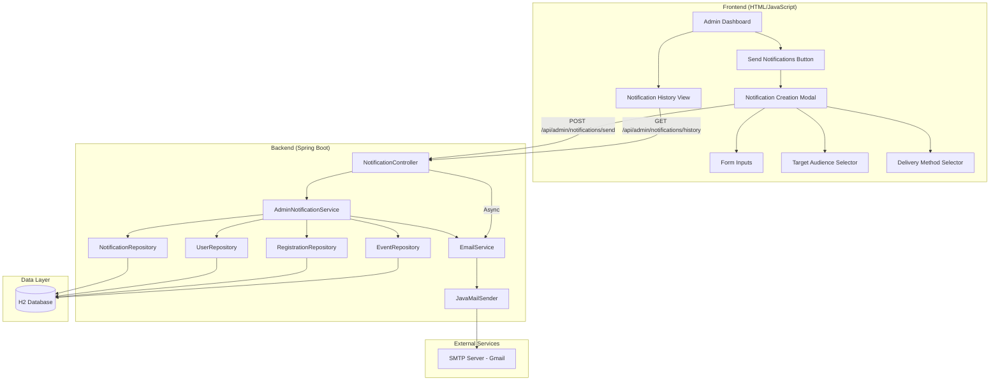

# Design Document: Admin Notification System

## Overview

The Admin Notification System is a full-stack feature that enables administrators to create and send notifications to students through multiple delivery channels (web notifications and email). The system consists of:

**Frontend Components:**
- Admin sidebar navigation with "Send Notifications" option
- Notification creation modal with form inputs
- Target audience selection interface
- Notification history view with filtering
- Success/error feedback UI

**Backend Services:**
- REST API endpoints for notification creation and management
- Email service with SMTP integration
- Notification storage and retrieval
- Bulk notification processing with async email delivery
- Authorization middleware for admin-only access

The system integrates with the existing College Event Management System, leveraging the current User, Event, Registration, and Notification models. It supports targeted delivery to all students, specific event participants, or individual students, with configurable delivery methods (web only, email only, or both).

## Architecture

### System Architecture Diagram



### Component Responsibilities

**Frontend Components:**
- **Admin Dashboard**: Entry point for admin users, displays navigation to notification features
- **Notification Creation Modal**: Form interface for composing notifications with validation
- **Target Audience Selector**: UI for selecting recipients (all students, event participants, individuals)
- **Notification History View**: Paginated list of sent notifications with filtering capabilities

**Backend Services:**
- **AdminNotificationService**: Core business logic for notification creation, recipient resolution, and bulk processing
- **EmailService**: Handles email composition, SMTP configuration, and asynchronous email delivery
- **NotificationController**: REST API endpoints with admin authorization checks
- **Repositories**: Data access layer for users, events, registrations, and notifications

### Technology Stack

**Frontend:**
- HTML5, CSS3, JavaScript (ES6+)
- Fetch API for HTTP requests
- Bootstrap 5 for UI components

**Backend:**
- Spring Boot 3.x
- Spring Data JPA
- Spring Mail (JavaMailSender)
- H2 Database (development), MySQL (production)
- Jakarta Persistence API

**Email:**
- SMTP protocol with TLS encryption
- Gmail SMTP server (configurable)

### Data Flow

**Notification Creation Flow:**
1. Admin user opens notification creation modal
2. User fills form: title, message, type, delivery method, target audience
3. Frontend validates inputs and displays recipient count
4. User clicks "Send" button
5. Frontend sends POST request to `/api/admin/notifications/send`
6. Backend validates admin role and request payload
7. Backend resolves recipient list based on target audience
8. Backend creates notification records in database (web notifications)
9. Backend queues email sending tasks (if email delivery selected)
10. Backend returns success response with recipient count
11. Frontend displays success message and clears form
12. Email service processes email queue asynchronously in background

**Notification History Flow:**
1. Admin user navigates to notification history
2. Frontend sends GET request to `/api/admin/notifications/history`
3. Backend validates admin role
4. Backend retrieves notifications with pagination and filters
5. Backend returns notification list with metadata
6. Frontend displays notifications in table format

## Components and Interfaces

### Frontend Components

#### 1. Admin Sidebar Navigation

**Purpose**: Provide access to notification features from admin dashboard

**HTML Structure**:
```html
<div class="admin-sidebar">
  <ul class="nav flex-column">
    <li class="nav-item">
      <a class="nav-link" href="#" id="sendNotificationBtn">
        <i class="bi bi-bell"></i> Send Notifications
      </a>
    </li>
    <li class="nav-item">
      <a class="nav-link" href="#" id="notificationHistoryBtn">
        <i class="bi bi-clock-history"></i> Notification History
      </a>
    </li>
  </ul>
</div>
```

**Event Handlers**:
- `sendNotificationBtn.click`: Opens notification creation modal
- `notificationHistoryBtn.click`: Navigates to notification history view

#### 2. Notification Creation Modal

**Purpose**: Form interface for creating and sending notifications

**Key Elements**:
- Title input (max 200 characters)
- Message textarea (max 2000 characters)
- Notification type dropdown (announcement, reminder, result)
- Delivery method checkboxes (web, email)
- Target audience radio buttons (all students, event participants, individual students)
- Event selector (conditional, shown when "event participants" selected)
- Student multi-select (conditional, shown when "individual students" selected)
- Recipient count display
- Event association selector (optional)
- Send button (enabled only when form is valid)

**Validation Rules**:
- Title: required, max 200 characters
- Message: required, max 2000 characters
- Notification type: required
- Delivery method: at least one selected
- Target audience: required
- Event selection: required when "event participants" selected
- Student selection: required when "individual students" selected, max 100

**API Integration**:
```javascript
async function sendNotification(notificationData) {
  const response = await fetch('/api/admin/notifications/send', {
    method: 'POST',
    headers: {
      'Content-Type': 'application/json',
      'Authorization': `Bearer ${getAuthToken()}`
    },
    body: JSON.stringify(notificationData)
  });
  return response.json();
}
```

#### 3. Target Audience Selector

**Purpose**: UI for selecting notification recipients

**Options**:
1. **All Students**: Radio button, no additional inputs
2. **Event Participants**: Radio button + event dropdown
3. **Individual Students**: Radio button + searchable multi-select

**Dynamic Behavior**:
- When "Event Participants" selected: Show event dropdown, fetch events from `/api/events`
- When "Individual Students" selected: Show student multi-select, fetch students from `/api/users?role=Student`
- Display recipient count after selection

#### 4. Notification History View

**Purpose**: Display paginated list of sent notifications with filtering

**Table Columns**:
- Title
- Type (with icon)
- Target Audience (description)
- Delivery Method (web/email/both)
- Recipient Count
- Associated Event (if any)
- Created Date
- Created By (admin name)

**Filters**:
- Notification type dropdown
- Date range picker (start date, end date)
- Search by title

**Pagination**:
- 20 notifications per page
- Previous/Next buttons
- Page number display

**API Integration**:
```javascript
async function fetchNotificationHistory(page, filters) {
  const params = new URLSearchParams({
    page: page,
    size: 20,
    ...filters
  });
  const response = await fetch(`/api/admin/notifications/history?${params}`, {
    headers: {
      'Authorization': `Bearer ${getAuthToken()}`
    }
  });
  return response.json();
}
```

### Backend Components

#### 1. AdminNotificationController

**Purpose**: REST API endpoints for admin notification operations

**Endpoints**:

```java
@RestController
@RequestMapping("/api/admin/notifications")
@CrossOrigin(origins = "*")
public class AdminNotificationController {
    
    @PostMapping("/send")
    public ResponseEntity<NotificationResponse> sendNotification(
        @RequestBody NotificationRequest request,
        @RequestHeader("Authorization") String authToken
    );
    
    @GetMapping("/history")
    public ResponseEntity<Page<NotificationHistoryDTO>> getNotificationHistory(
        @RequestParam(defaultValue = "0") int page,
        @RequestParam(defaultValue = "20") int size,
        @RequestParam(required = false) String type,
        @RequestParam(required = false) LocalDate startDate,
        @RequestParam(required = false) LocalDate endDate
    );
    
    @GetMapping("/recipient-count")
    public ResponseEntity<RecipientCountResponse> getRecipientCount(
        @RequestParam String targetAudience,
        @RequestParam(required = false) Long eventId,
        @RequestParam(required = false) List<Long> studentIds
    );
}
```

**Authorization**:
- All endpoints require admin role verification
- Extract user from auth token
- Check `user.getRole().equals("Admin")`
- Return 403 Forbidden if not admin

#### 2. AdminNotificationService

**Purpose**: Core business logic for notification creation and management

**Key Methods**:

```java
@Service
public class AdminNotificationService {
    
    public NotificationResponse sendNotification(NotificationRequest request, User admin);
    
    public List<User> resolveRecipients(
        String targetAudience,
        Long eventId,
        List<Long> studentIds
    );
    
    public List<Notification> createWebNotifications(
        List<User> recipients,
        NotificationRequest request
    );
    
    public void sendEmailNotificationsAsync(
        List<User> recipients,
        NotificationRequest request
    );
    
    public Page<NotificationHistoryDTO> getNotificationHistory(
        int page,
        int size,
        String type,
        LocalDate startDate,
        LocalDate endDate
    );
}
```

**Recipient Resolution Logic**:
- **All Students**: Query `UserRepository.findByRole("Student")`
- **Event Participants**: Query `RegistrationRepository.findByEventId(eventId)`, extract user IDs, fetch users
- **Individual Students**: Validate student IDs, fetch users by IDs

**Bulk Processing**:
- Process notifications in batches of 100 for large recipient lists
- Create web notifications synchronously (fast database inserts)
- Queue email notifications for async processing
- Log batch processing start/end times

#### 3. EmailService

**Purpose**: Handle email composition and delivery

**Key Methods**:

```java
@Service
public class EmailService {
    
    @Autowired
    private JavaMailSender mailSender;
    
    @Value("${spring.mail.username}")
    private String fromEmail;
    
    @Async
    public void sendEmailAsync(User recipient, NotificationRequest request);
    
    public void sendBulkEmailsAsync(List<User> recipients, NotificationRequest request);
    
    private MimeMessage createEmailMessage(User recipient, NotificationRequest request);
    
    private String formatEmailBody(NotificationRequest request);
    
    public boolean validateSmtpConfiguration();
}
```

**Email Template**:
```html
<!DOCTYPE html>
<html>
<head>
    <style>
        body { font-family: Arial, sans-serif; }
        .header { background-color: #007bff; color: white; padding: 20px; }
        .content { padding: 20px; }
        .footer { background-color: #f8f9fa; padding: 10px; text-align: center; }
    </style>
</head>
<body>
    <div class="header">
        <h2>{{notificationType}} - {{title}}</h2>
    </div>
    <div class="content">
        <p>{{message}}</p>
        {{#if eventTitle}}
        <p><strong>Related Event:</strong> {{eventTitle}}</p>
        <p><a href="{{eventLink}}">View Event Details</a></p>
        {{/if}}
    </div>
    <div class="footer">
        <p>College Event Management System</p>
    </div>
</body>
</html>
```

**Async Configuration**:
- Use `@Async` annotation for email sending methods
- Configure thread pool executor with max 10 concurrent threads
- Handle email failures gracefully with logging

**Error Handling**:
- Catch `MailException` for SMTP errors
- Log error with recipient email and error message
- Continue processing remaining emails
- Do not throw exception to prevent batch failure

#### 4. Authorization Middleware

**Purpose**: Verify admin role for protected endpoints

**Implementation**:
```java
@Component
public class AdminAuthorizationInterceptor implements HandlerInterceptor {
    
    @Autowired
    private UserRepository userRepository;
    
    @Override
    public boolean preHandle(
        HttpServletRequest request,
        HttpServletResponse response,
        Object handler
    ) throws Exception {
        String authToken = request.getHeader("Authorization");
        
        if (authToken == null || !authToken.startsWith("Bearer ")) {
            response.setStatus(HttpServletResponse.SC_UNAUTHORIZED);
            return false;
        }
        
        // Extract user from token (implementation depends on auth system)
        User user = extractUserFromToken(authToken);
        
        if (user == null || !"Admin".equals(user.getRole())) {
            response.setStatus(HttpServletResponse.SC_FORBIDDEN);
            return false;
        }
        
        request.setAttribute("currentUser", user);
        return true;
    }
}
```

**Registration**:
```java
@Configuration
public class WebMvcConfig implements WebMvcConfigurer {
    
    @Autowired
    private AdminAuthorizationInterceptor adminAuthInterceptor;
    
    @Override
    public void addInterceptors(InterceptorRegistry registry) {
        registry.addInterceptor(adminAuthInterceptor)
                .addPathPatterns("/api/admin/**");
    }
}
```

## Data Models

### Notification Model (Existing - Extended)

**Entity**: `com.college.event.model.Notification`

**Table**: `notifications`

**Fields**:
```java
@Entity
@Table(name = "notifications")
public class Notification {
    @Id
    @GeneratedValue(strategy = GenerationType.IDENTITY)
    private Long id;
    
    private Long userId;              // Recipient user ID
    private String userName;          // Recipient name (denormalized)
    private String userEmail;         // Recipient email (denormalized)
    
    private String title;             // Max 200 characters
    private String message;           // Max 2000 characters
    private String type;              // "announcement", "reminder", "result"
    
    private Long relatedEventId;      // Optional event association
    private String relatedEventTitle; // Optional event title (denormalized)
    
    private Boolean isRead;           // Read status
    private LocalDateTime createdDate;
    private LocalDateTime readDate;
    
    // New fields for admin notifications
    private Long createdBy;           // Admin user ID who created notification
    private String deliveryMethod;    // "WEB", "EMAIL", "BOTH"
    private String targetAudience;    // "ALL_STUDENTS", "EVENT_PARTICIPANTS", "INDIVIDUAL_STUDENTS"
    private Long targetEventId;       // Event ID if targetAudience is EVENT_PARTICIPANTS
}
```

**Indexes**:
- `userId` (for user notification queries)
- `createdDate` (for history sorting)
- `createdBy` (for admin history queries)
- `targetAudience, targetEventId` (for history filtering)

### NotificationRequest DTO

**Purpose**: Request payload for creating notifications

```java
public class NotificationRequest {
    @NotBlank(message = "Title is required")
    @Size(max = 200, message = "Title must be 200 characters or less")
    private String title;
    
    @NotBlank(message = "Message is required")
    @Size(max = 2000, message = "Message must be 2000 characters or less")
    private String message;
    
    @NotBlank(message = "Notification type is required")
    @Pattern(regexp = "announcement|reminder|result", message = "Invalid notification type")
    private String type;
    
    @NotEmpty(message = "At least one delivery method is required")
    private List<String> deliveryMethods; // ["WEB", "EMAIL"]
    
    @NotBlank(message = "Target audience is required")
    @Pattern(regexp = "ALL_STUDENTS|EVENT_PARTICIPANTS|INDIVIDUAL_STUDENTS")
    private String targetAudience;
    
    private Long eventId;              // Required if targetAudience is EVENT_PARTICIPANTS
    private List<Long> studentIds;     // Required if targetAudience is INDIVIDUAL_STUDENTS
    
    private Long relatedEventId;       // Optional event association
    
    // Getters and setters
}
```

**Validation**:
- Bean Validation annotations for field constraints
- Custom validator for conditional requirements (eventId, studentIds)

### NotificationResponse DTO

**Purpose**: Response payload for notification creation

```java
public class NotificationResponse {
    private boolean success;
    private String message;
    private int recipientCount;
    private int webNotificationsCreated;
    private int emailsQueued;
    private List<String> errors;
    
    // Getters and setters
}
```

### NotificationHistoryDTO

**Purpose**: Response payload for notification history

```java
public class NotificationHistoryDTO {
    private Long id;
    private String title;
    private String type;
    private String targetAudienceDescription; // Human-readable description
    private String deliveryMethod;
    private int recipientCount;
    private String relatedEventTitle;
    private LocalDateTime createdDate;
    private String createdByName;             // Admin name
    
    // Getters and setters
}
```

### RecipientCountResponse DTO

**Purpose**: Response payload for recipient count preview

```java
public class RecipientCountResponse {
    private int count;
    private String description; // e.g., "All students", "Participants of Event X"
    
    // Getters and setters
}
```

### User Model (Existing - No Changes)

**Entity**: `com.college.event.model.User`

**Relevant Fields**:
- `id`: User ID
- `name`: User name
- `email`: User email
- `role`: "Student" or "Admin"

### Event Model (Existing - No Changes)

**Entity**: `com.college.event.model.Event`

**Relevant Fields**:
- `id`: Event ID
- `title`: Event title

### Registration Model (Existing - No Changes)

**Entity**: `com.college.event.model.Registration`

**Relevant Fields**:
- `userId`: Registered user ID
- `eventId`: Event ID
- `userEmail`: User email (denormalized)

## API Specifications

### POST /api/admin/notifications/send

**Purpose**: Create and send notifications to selected recipients

**Authorization**: Admin role required

**Request Headers**:
```
Content-Type: application/json
Authorization: Bearer <token>
```

**Request Body**:
```json
{
  "title": "Event Registration Deadline",
  "message": "Reminder: Registration for Tech Fest 2024 closes on March 15th. Don't miss out!",
  "type": "reminder",
  "deliveryMethods": ["WEB", "EMAIL"],
  "targetAudience": "ALL_STUDENTS",
  "eventId": null,
  "studentIds": null,
  "relatedEventId": 5
}
```

**Response** (200 OK):
```json
{
  "success": true,
  "message": "Notifications sent successfully",
  "recipientCount": 250,
  "webNotificationsCreated": 250,
  "emailsQueued": 250,
  "errors": []
}
```

**Response** (400 Bad Request):
```json
{
  "success": false,
  "message": "Validation failed",
  "recipientCount": 0,
  "webNotificationsCreated": 0,
  "emailsQueued": 0,
  "errors": [
    "Title is required",
    "At least one delivery method is required"
  ]
}
```

**Response** (403 Forbidden):
```json
{
  "success": false,
  "message": "Access denied. Admin role required.",
  "recipientCount": 0,
  "webNotificationsCreated": 0,
  "emailsQueued": 0,
  "errors": []
}
```

### GET /api/admin/notifications/history

**Purpose**: Retrieve paginated notification history with filtering

**Authorization**: Admin role required

**Request Headers**:
```
Authorization: Bearer <token>
```

**Query Parameters**:
- `page` (optional, default: 0): Page number
- `size` (optional, default: 20): Page size
- `type` (optional): Filter by notification type (announcement, reminder, result)
- `startDate` (optional): Filter by start date (ISO 8601 format)
- `endDate` (optional): Filter by end date (ISO 8601 format)

**Example Request**:
```
GET /api/admin/notifications/history?page=0&size=20&type=reminder&startDate=2024-01-01
```

**Response** (200 OK):
```json
{
  "content": [
    {
      "id": 123,
      "title": "Event Registration Deadline",
      "type": "reminder",
      "targetAudienceDescription": "All students",
      "deliveryMethod": "BOTH",
      "recipientCount": 250,
      "relatedEventTitle": "Tech Fest 2024",
      "createdDate": "2024-03-10T14:30:00",
      "createdByName": "Admin User"
    }
  ],
  "pageable": {
    "pageNumber": 0,
    "pageSize": 20
  },
  "totalElements": 45,
  "totalPages": 3,
  "last": false
}
```

### GET /api/admin/notifications/recipient-count

**Purpose**: Preview recipient count before sending notification

**Authorization**: Admin role required

**Request Headers**:
```
Authorization: Bearer <token>
```

**Query Parameters**:
- `targetAudience` (required): "ALL_STUDENTS", "EVENT_PARTICIPANTS", or "INDIVIDUAL_STUDENTS"
- `eventId` (optional): Required if targetAudience is EVENT_PARTICIPANTS
- `studentIds` (optional): Comma-separated list, required if targetAudience is INDIVIDUAL_STUDENTS

**Example Request**:
```
GET /api/admin/notifications/recipient-count?targetAudience=EVENT_PARTICIPANTS&eventId=5
```

**Response** (200 OK):
```json
{
  "count": 45,
  "description": "Participants of Tech Fest 2024"
}
```

### GET /api/users

**Purpose**: Retrieve list of users (for student selection)

**Authorization**: Admin role required

**Query Parameters**:
- `role` (optional): Filter by role ("Student" or "Admin")

**Response** (200 OK):
```json
[
  {
    "id": 1,
    "name": "John Doe",
    "email": "john@example.com",
    "role": "Student"
  },
  {
    "id": 2,
    "name": "Jane Smith",
    "email": "jane@example.com",
    "role": "Student"
  }
]
```

### GET /api/events

**Purpose**: Retrieve list of events (for event selection)

**Authorization**: Admin role required

**Response** (200 OK):
```json
[
  {
    "id": 5,
    "title": "Tech Fest 2024",
    "date": "2024-03-20",
    "location": "Main Auditorium",
    "category": "Technical"
  }
]
```


## Correctness Properties

*A property is a characteristic or behavior that should hold true across all valid executions of a system—essentially, a formal statement about what the system should do. Properties serve as the bridge between human-readable specifications and machine-verifiable correctness guarantees.*

### Property Reflection

After analyzing all acceptance criteria, I identified the following properties suitable for property-based testing. I eliminated redundant properties where one property implies another:

**Eliminated Redundancies:**
- Properties 3.2 and 3.4 both test data persistence - combined into Property 1
- Properties 3.2, 7.5, and 8.1 all test field storage - combined into Property 1
- Properties 5.2 and 3.1 both test notification creation for all recipients - combined into Property 2
- Properties 6.4 and 3.6 both test sorting by timestamp - combined into Property 3
- Properties 4.5 and 8.4 both test event details in emails - combined into Property 7
- Properties 12.4 and 12.5 both test async response behavior - combined into Property 18

### Property 1: Notification Data Persistence Round-Trip

*For any* valid notification data (title, message, type, event association), when a web notification is created and stored, retrieving it from the database SHALL return all fields with values matching the original input.

**Validates: Requirements 3.2, 3.4, 7.5, 8.1**

### Property 2: Recipient Count Matches Notification Count

*For any* list of recipients and delivery method including web notifications, when notifications are created, the number of notification records in the database SHALL equal the number of recipients.

**Validates: Requirements 3.1, 5.2**

### Property 3: Notification Sorting by Timestamp

*For any* list of notifications with different creation timestamps, when retrieved from the database, they SHALL be ordered by createdDate in descending order (newest first).

**Validates: Requirements 3.6, 6.4**

### Property 4: Default Field Values on Creation

*For any* newly created web notification, the isRead field SHALL be false and the createdDate field SHALL be set to a timestamp within 1 second of the current time.

**Validates: Requirements 3.3**

### Property 5: All Students Recipient Resolution

*For any* user database containing users with roles "Student" and "Admin", when target audience is "ALL_STUDENTS", the resolved recipient list SHALL contain only users with role "Student" and SHALL contain all such users.

**Validates: Requirements 2.2**

### Property 6: Event Participants Recipient Resolution

*For any* registration database and event ID, when target audience is "EVENT_PARTICIPANTS", the resolved recipient list SHALL contain exactly the users registered for that event.

**Validates: Requirements 2.4**

### Property 7: Email Composition with Event Association

*For any* notification with an event association, when an email is composed, the email body SHALL contain both the event title and a link to the event details page.

**Validates: Requirements 4.5, 8.4**

### Property 8: Email Subject Matches Title

*For any* notification, when an email is composed, the email subject SHALL exactly match the notification title.

**Validates: Requirements 4.3**

### Property 9: Email Body Contains Message

*For any* notification, when an email is composed, the email body SHALL contain the notification message text.

**Validates: Requirements 4.4**

### Property 10: Email HTML Formatting

*For any* notification, when an email is composed, the email content type SHALL be "text/html".

**Validates: Requirements 4.6**

### Property 11: Email Sender Configuration

*For any* notification, when an email is composed, the sender email address SHALL match the configured value from application properties.

**Validates: Requirements 9.3, 9.4**

### Property 12: Null Event Association Storage

*For any* notification without an event association, when stored in the database, the relatedEventId and relatedEventTitle fields SHALL both be null.

**Validates: Requirements 8.5**

### Property 13: Notification History Field Completeness

*For any* notification in the history, the returned DTO SHALL contain all required fields: title, type, target audience description, delivery method, recipient count, and creation timestamp.

**Validates: Requirements 6.3**

### Property 14: Notification History Pagination

*For any* list of notifications with size N and page size P, when retrieving page X, the returned page SHALL contain min(P, N - X*P) notifications and the total pages SHALL equal ceil(N/P).

**Validates: Requirements 6.5**

### Property 15: History Filtering by Type

*For any* notification history and notification type filter, when filtering by type, all returned notifications SHALL have the specified type.

**Validates: Requirements 6.7**

### Property 16: History Filtering by Date Range

*For any* notification history and date range (start date, end date), when filtering by date range, all returned notifications SHALL have creation timestamps within the range [start date, end date].

**Validates: Requirements 6.8**

### Property 17: Admin Authorization Check

*For any* user with role other than "Admin", when attempting to access admin notification endpoints, the system SHALL return an HTTP 403 Forbidden response.

**Validates: Requirements 11.1, 11.4**

### Property 18: Async Email Response

*For any* notification request with email delivery method, when the notification is sent, the API response SHALL be returned within 5 seconds regardless of the number of recipients (email sending SHALL not block the response).

**Validates: Requirements 12.4, 12.5**

### Property 19: Batch Processing for Large Recipient Lists

*For any* recipient list with size greater than 100, when processing notifications, the system SHALL divide the recipients into batches of 100 or fewer.

**Validates: Requirements 12.2**

### Property 20: Bulk Operation Logging

*For any* bulk notification operation, the system SHALL log both a start timestamp and a completion timestamp.

**Validates: Requirements 12.7**

### Property 21: Title Length Validation

*For any* string with length L, when used as a notification title, it SHALL be accepted if and only if 1 <= L <= 200.

**Validates: Requirements 1.2**

### Property 22: Message Length Validation

*For any* string with length L, when used as a notification message, it SHALL be accepted if and only if 1 <= L <= 2000.

**Validates: Requirements 1.3**

### Property 23: Student Selection Count Validation

*For any* list of student IDs with size N, when target audience is "INDIVIDUAL_STUDENTS", the request SHALL be accepted if and only if 1 <= N <= 100.

**Validates: Requirements 2.6**

### Property 24: Email Error Resilience

*For any* list of recipients where some email sends fail, the system SHALL continue attempting to send emails to all remaining recipients and SHALL not throw an exception that halts processing.

**Validates: Requirements 4.8**

### Property 25: Email Error Logging

*For any* failed email send, the system SHALL log an error message containing both the recipient email address and the error message from the mail service.

**Validates: Requirements 4.7**

### Property 26: Dual Delivery Method

*For any* notification request with delivery method "BOTH" and recipient list, the system SHALL create both web notification records and queue email sends for each recipient.

**Validates: Requirements 5.3**

### Property 27: Notification Type Acceptance

*For any* notification type value in the set {"announcement", "reminder", "result"}, when used in a notification request, it SHALL be accepted by the system.

**Validates: Requirements 7.1**

### Property 28: Email Notification Type Label

*For any* notification, when an email is composed, the email SHALL include the notification type as a visible label in the email content.

**Validates: Requirements 7.6**

### Property 29: Email Address Extraction

*For any* user in the recipient list, when composing an email, the email address SHALL be extracted from the User model's email field.

**Validates: Requirements 4.2**

### Property 30: Validation Before Send

*For any* notification request, when the send operation is initiated, the system SHALL validate all required fields before creating any notification records.

**Validates: Requirements 5.1**

## Error Handling

### Validation Errors

**Frontend Validation:**
- Perform client-side validation before API calls
- Display inline error messages for each invalid field
- Disable send button when validation fails
- Clear error messages when user corrects input

**Backend Validation:**
- Use Bean Validation annotations (@NotBlank, @Size, @Pattern)
- Return 400 Bad Request with detailed error messages
- Include field names and validation constraints in error response

**Validation Error Response Format:**
```json
{
  "success": false,
  "message": "Validation failed",
  "errors": [
    {
      "field": "title",
      "message": "Title is required"
    },
    {
      "field": "message",
      "message": "Message must be 2000 characters or less"
    }
  ]
}
```

### Authorization Errors

**Admin Role Verification:**
- Check user role before processing any admin endpoint request
- Return 401 Unauthorized if no auth token provided
- Return 403 Forbidden if user is not admin
- Log unauthorized access attempts

**Error Response Format:**
```json
{
  "success": false,
  "message": "Access denied. Admin role required.",
  "timestamp": "2024-03-10T14:30:00"
}
```

### Email Service Errors

**SMTP Configuration Errors:**
- Validate SMTP configuration on application startup
- Log error if configuration is invalid
- Set email service status to disabled
- Display warning in admin UI when email functionality is unavailable

**Email Send Errors:**
- Catch MailException for individual email failures
- Log error with recipient email and error message
- Continue processing remaining emails
- Do not throw exception that halts batch processing
- Include failed email count in response

**Error Logging Format:**
```
ERROR [EmailService] Failed to send email to john@example.com: Connection timeout
ERROR [EmailService] Failed to send email to jane@example.com: Invalid recipient address
```

### Database Errors

**Connection Errors:**
- Catch DataAccessException for database errors
- Return 500 Internal Server Error
- Log error with stack trace
- Display generic error message to user (do not expose internal details)

**Constraint Violation Errors:**
- Catch ConstraintViolationException
- Return 400 Bad Request with user-friendly message
- Log error for debugging

### Bulk Processing Errors

**Partial Failure Handling:**
- Track successful and failed operations separately
- Return partial success response with counts
- Include error details for failed operations
- Log all errors for troubleshooting

**Partial Success Response Format:**
```json
{
  "success": true,
  "message": "Notifications sent with some errors",
  "recipientCount": 250,
  "webNotificationsCreated": 250,
  "emailsQueued": 245,
  "emailsFailed": 5,
  "errors": [
    "Failed to send email to invalid@example.com: Invalid address",
    "Failed to send email to bounced@example.com: Mailbox full"
  ]
}
```

### Timeout Handling

**API Request Timeouts:**
- Set request timeout to 60 seconds
- Return 504 Gateway Timeout if exceeded
- Log timeout errors with request details

**Email Send Timeouts:**
- Set individual email timeout to 30 seconds
- Log timeout and continue with next recipient
- Include timeout count in response

### Graceful Degradation

**Email Service Unavailable:**
- Allow web-only notifications when email service is down
- Display warning to admin users
- Log email service status

**Database Read-Only Mode:**
- Detect read-only database state
- Return 503 Service Unavailable
- Display maintenance message to users

## Testing Strategy

### Unit Tests

**Purpose**: Test individual components and methods in isolation

**Scope**:
- Validation logic (title length, message length, student count)
- Recipient resolution logic (all students, event participants, individual students)
- Email composition logic (subject, body, HTML formatting)
- Authorization checks (admin role verification)
- Error handling (validation errors, email failures)

**Framework**: JUnit 5 with Mockito for mocking dependencies

**Example Unit Tests**:
```java
@Test
void testTitleLengthValidation_AcceptsValidLength() {
    String title = "A".repeat(200);
    assertTrue(validator.isValidTitle(title));
}

@Test
void testTitleLengthValidation_RejectsExcessiveLength() {
    String title = "A".repeat(201);
    assertFalse(validator.isValidTitle(title));
}

@Test
void testResolveRecipients_AllStudents_ReturnsOnlyStudents() {
    List<User> users = Arrays.asList(
        createUser(1L, "Student"),
        createUser(2L, "Admin"),
        createUser(3L, "Student")
    );
    when(userRepository.findByRole("Student")).thenReturn(
        users.stream().filter(u -> "Student".equals(u.getRole())).toList()
    );
    
    List<User> recipients = service.resolveRecipients("ALL_STUDENTS", null, null);
    
    assertEquals(2, recipients.size());
    assertTrue(recipients.stream().allMatch(u -> "Student".equals(u.getRole())));
}
```

### Property-Based Tests

**Purpose**: Verify universal properties across many generated inputs

**Framework**: jqwik (Java property-based testing library)

**Configuration**:
- Minimum 100 iterations per property test
- Each test tagged with feature name and property number
- Tag format: `@Tag("Feature: admin-notification-system, Property X: [property text]")`

**Example Property Tests**:
```java
@Property
@Tag("Feature: admin-notification-system, Property 1: Notification Data Persistence Round-Trip")
void notificationDataPersistenceRoundTrip(
    @ForAll @StringLength(min = 1, max = 200) String title,
    @ForAll @StringLength(min = 1, max = 2000) String message,
    @ForAll("notificationTypes") String type,
    @ForAll @LongRange(min = 1, max = 1000) Long userId
) {
    Notification notification = new Notification();
    notification.setUserId(userId);
    notification.setTitle(title);
    notification.setMessage(message);
    notification.setType(type);
    
    Notification saved = notificationRepository.save(notification);
    Notification retrieved = notificationRepository.findById(saved.getId()).orElseThrow();
    
    assertEquals(title, retrieved.getTitle());
    assertEquals(message, retrieved.getMessage());
    assertEquals(type, retrieved.getType());
    assertEquals(userId, retrieved.getUserId());
}

@Provide
Arbitrary<String> notificationTypes() {
    return Arbitraries.of("announcement", "reminder", "result");
}

@Property
@Tag("Feature: admin-notification-system, Property 5: All Students Recipient Resolution")
void allStudentsRecipientResolution(
    @ForAll @Size(min = 1, max = 100) List<@From("users") User> userDatabase
) {
    when(userRepository.findByRole("Student")).thenReturn(
        userDatabase.stream().filter(u -> "Student".equals(u.getRole())).toList()
    );
    
    List<User> recipients = service.resolveRecipients("ALL_STUDENTS", null, null);
    
    long expectedStudentCount = userDatabase.stream()
        .filter(u -> "Student".equals(u.getRole()))
        .count();
    
    assertEquals(expectedStudentCount, recipients.size());
    assertTrue(recipients.stream().allMatch(u -> "Student".equals(u.getRole())));
}

@Provide
Arbitrary<User> users() {
    return Combinators.combine(
        Arbitraries.longs().greaterOrEqual(1L),
        Arbitraries.strings().alpha().ofMinLength(3).ofMaxLength(50),
        Arbitraries.strings().alpha().ofMinLength(5).ofMaxLength(50).map(s -> s + "@example.com"),
        Arbitraries.of("Student", "Admin")
    ).as((id, name, email, role) -> {
        User user = new User();
        user.setId(id);
        user.setName(name);
        user.setEmail(email);
        user.setRole(role);
        return user;
    });
}
```

### Integration Tests

**Purpose**: Test interactions between components and external services

**Scope**:
- API endpoint integration (request/response flow)
- Database integration (CRUD operations)
- Email service integration (SMTP connection, email sending)
- Authorization integration (token validation, role checking)
- UI integration (form submission, notification display)

**Framework**: Spring Boot Test with @SpringBootTest

**Example Integration Tests**:
```java
@SpringBootTest
@AutoConfigureMockMvc
class AdminNotificationControllerIntegrationTest {
    
    @Autowired
    private MockMvc mockMvc;
    
    @Test
    void testSendNotification_Success() throws Exception {
        String requestBody = """
            {
                "title": "Test Notification",
                "message": "This is a test message",
                "type": "announcement",
                "deliveryMethods": ["WEB"],
                "targetAudience": "ALL_STUDENTS"
            }
            """;
        
        mockMvc.perform(post("/api/admin/notifications/send")
                .header("Authorization", "Bearer " + getAdminToken())
                .contentType(MediaType.APPLICATION_JSON)
                .content(requestBody))
            .andExpect(status().isOk())
            .andExpect(jsonPath("$.success").value(true))
            .andExpect(jsonPath("$.recipientCount").isNumber());
    }
    
    @Test
    void testSendNotification_Unauthorized() throws Exception {
        String requestBody = """
            {
                "title": "Test Notification",
                "message": "This is a test message",
                "type": "announcement",
                "deliveryMethods": ["WEB"],
                "targetAudience": "ALL_STUDENTS"
            }
            """;
        
        mockMvc.perform(post("/api/admin/notifications/send")
                .header("Authorization", "Bearer " + getStudentToken())
                .contentType(MediaType.APPLICATION_JSON)
                .content(requestBody))
            .andExpect(status().isForbidden());
    }
}
```

### Performance Tests

**Purpose**: Verify system performance under load

**Scope**:
- Bulk notification creation (500-1000 recipients)
- Email sending throughput (concurrent email sends)
- Database query performance (notification history with large datasets)
- API response times (under various load conditions)

**Tools**: JMeter or Gatling for load testing

**Performance Targets**:
- Create web notifications for 1000 recipients within 10 seconds
- API response time < 5 seconds for bulk operations
- Email queue processing rate > 10 emails/second
- Notification history query < 1 second for 10,000 records

### End-to-End Tests

**Purpose**: Test complete user workflows from UI to database

**Scope**:
- Admin creates notification and sends to all students
- Admin creates notification for event participants
- Admin views notification history with filters
- Student receives and views web notification
- Student receives email notification

**Framework**: Selenium WebDriver for UI automation

**Example E2E Test**:
```java
@Test
void testAdminSendsNotificationToAllStudents() {
    // Login as admin
    loginPage.login("admin@example.com", "password");
    
    // Navigate to send notifications
    adminDashboard.clickSendNotifications();
    
    // Fill notification form
    notificationModal.setTitle("Important Announcement");
    notificationModal.setMessage("All classes are cancelled tomorrow.");
    notificationModal.selectType("announcement");
    notificationModal.selectDeliveryMethod("WEB");
    notificationModal.selectTargetAudience("ALL_STUDENTS");
    
    // Send notification
    notificationModal.clickSend();
    
    // Verify success message
    assertTrue(notificationModal.isSuccessMessageDisplayed());
    assertTrue(notificationModal.getSuccessMessage().contains("sent successfully"));
    
    // Verify notification appears in history
    adminDashboard.clickNotificationHistory();
    assertTrue(notificationHistory.containsNotification("Important Announcement"));
}
```

### Test Coverage Goals

**Code Coverage Targets**:
- Line coverage: > 80%
- Branch coverage: > 75%
- Method coverage: > 90%

**Property Test Coverage**:
- All 30 correctness properties implemented as property-based tests
- Minimum 100 iterations per property test
- All properties tagged with feature name and property number

**Integration Test Coverage**:
- All API endpoints tested
- All authorization scenarios tested
- All error handling paths tested
- Email service integration tested with mock SMTP server

### Test Data Management

**Test Database**:
- Use H2 in-memory database for unit and integration tests
- Reset database state between tests
- Use @Transactional for automatic rollback

**Test Data Builders**:
- Create builder classes for test data generation
- Use realistic test data (valid email addresses, reasonable text lengths)
- Reuse builders across tests for consistency

**Mock Data**:
- Mock external services (SMTP server) for unit tests
- Use real services for integration tests (with test SMTP server)
- Mock authentication/authorization for isolated component tests

### Continuous Integration

**CI Pipeline**:
1. Run unit tests on every commit
2. Run property-based tests on every commit
3. Run integration tests on pull requests
4. Run performance tests nightly
5. Run E2E tests before release

**Test Reporting**:
- Generate test coverage reports
- Track test execution time trends
- Alert on test failures
- Display property test statistics (iterations, failures, shrinking)
