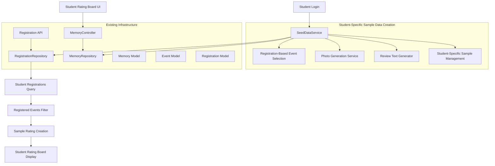

# Design Document: Event Rating Board with Sample Data

## Overview

This feature implements a student-focused rating board that displays event ratings only for events the logged-in student has registered for, along with a sample data population service that creates personalized demonstration ratings based on each student's individual event registrations. The design integrates with the existing Registration system to query student registrations first, then creates 6-10 sample ratings specifically for the student's registered events.

The solution leverages the existing Memory model, MemoryRepository, and Registration system without requiring schema changes. Each student receives personalized sample ratings that reflect their own event portfolio, making the demonstration data relevant and meaningful. The SeedDataService queries the Registration system using the existing /api/registrations/user/{userId}/detailed endpoint, then creates sample ratings only for events the student has actually registered for.

## Architecture

### Component Overview



### Service Layer Architecture

The design introduces a single new service component while leveraging all existing infrastructure, with a focus on student-specific, registration-based sample data creation:

- **SeedDataService**: Orchestrates student-specific sample data creation based on individual registrations
- **PhotoDataProvider**: Provides Base64-encoded sample event photos matching registered event categories
- **ReviewContentGenerator**: Creates realistic review text tailored to registered event types
- **StudentRatingBoard**: Displays ratings filtered to show only the student's registered events
- **RegistrationIntegration**: Leverages existing Registration system for student event queries

## Components and Interfaces

### SeedDataService

**Purpose**: Main service responsible for creating student-specific sample rating data based on individual event registrations.

**Key Responsibilities**:
- Query student registrations using existing RegistrationRepository
- Create sample ratings only for events the student has registered for
- Generate 6-10 sample ratings per student (subset of their 10-12 total registrations)
- Ensure sample ratings are personalized and relevant to each student's event portfolio
- Prevent duplicate sample data creation for the same student

**Interface**:
```java
@Service
public class SeedDataService {
    public void initializeSampleDataForStudent(Long userId);
    private List<Registration> getStudentRegistrations(Long userId);
    private List<Event> selectRegisteredEventsForSamples(List<Registration> registrations);
    private Memory createStudentSpecificSampleRating(Event event, Long targetStudentId);
    private boolean studentSampleDataExists(Long userId);
}
```

**Dependencies**:
- RegistrationRepository (existing)
- MemoryRepository (existing)
- EventRepository (existing)
- PhotoDataProvider (new)
- ReviewContentGenerator (new)

### PhotoDataProvider

**Purpose**: Provides Base64-encoded sample event photos that match the categories of events the student has registered for.

**Key Responsibilities**:
- Store sample event photos as Base64 strings categorized by event type
- Match photos to registered event categories (group activities, performances, workshops)
- Ensure photos are appropriate for college event management context
- Provide category-specific photos based on student's registration portfolio

**Interface**:
```java
@Component
public class PhotoDataProvider {
    public String getPhotoForRegisteredEventCategory(String eventCategory);
    public List<String> getPhotosMatchingRegistrations(List<Registration> registrations);
    private String encodePhotoToBase64(String photoResource);
    private boolean hasRegistrationForCategory(List<Registration> registrations, String category);
}
```

### ReviewContentGenerator

**Purpose**: Creates realistic, varied review text tailored to the specific events the student has registered for.

**Key Responsibilities**:
- Generate review text between 50-300 characters that references actual registered events
- Match review tone to star rating (positive for 4-5 stars, constructive for 2-3 stars)
- Create diverse review styles (enthusiastic, descriptive, constructive)
- Tailor content to specific event types from student's registrations (technical workshop, cultural performance, sports event)
- Include actual event titles from student's registration records in review text

**Interface**:
```java
@Component
public class ReviewContentGenerator {
    public String generateReviewForRegisteredEvent(Event registeredEvent, int starRating);
    private String getReviewTemplateForEventType(String eventType, int starRating);
    private String personalizeReviewWithEventDetails(String template, Event event);
    private String ensureEventTitleInReview(String review, String eventTitle);
}
```

### StudentRatingBoard

**Purpose**: Displays event ratings filtered to show only ratings for events the logged-in student has registered for.

**Key Responsibilities**:
- Retrieve student's registered events using existing /api/registrations/user/{userId}/detailed endpoint
- Filter displayed ratings to show only ratings associated with student's registered event IDs
- Display sample ratings mixed with real ratings without visual distinction
- Order ratings by creation date with newest first
- Ensure personalized, relevant rating display for each student

**Interface**:
```java
@Component
public class StudentRatingBoard {
    public List<Memory> getStudentRegisteredEventRatings(Long userId);
    private List<Registration> getStudentRegistrations(Long userId);
    private List<Memory> filterRatingsByRegisteredEvents(List<Memory> allRatings, List<Long> registeredEventIds);
    private List<Memory> orderRatingsByDateDesc(List<Memory> ratings);
}
```

### Integration with Existing Components

**Registration System Integration**:
- Uses existing Registration model and RegistrationRepository
- Leverages existing /api/registrations/user/{userId}/detailed endpoint
- Queries student registrations via findByUserId method
- No modifications required to existing registration components

**Memory Model Integration**:
- Uses existing Memory entity without modifications
- Populates all required fields: userId, eventId, userName, userEmail, eventTitle, reviewText, imageUrl, rating, category
- Sets isApproved=true for immediate display
- Associates sample ratings with target student ID for personalization
- Adds sample data identification through userName pattern or additional tracking

**MemoryRepository Integration**:
- Uses existing repository methods for persistence and queries
- Leverages existing query methods for display (findByIsApprovedTrueOrderByCreatedDateDesc)
- Adds student-specific filtering capabilities for personalized display
- No new repository methods required

**MemoryController Integration**:
- Existing endpoints automatically serve student-specific sample data
- GET /api/memories returns sample ratings filtered by student's registered events
- No controller modifications required for basic functionality
- May require additional endpoint for student-specific filtering

## Data Models

### Student-Specific Sample Rating Data Structure

The sample ratings use the existing Memory model with these field assignments for student-specific data:

```java
// Student-Specific Sample Rating Field Mapping
Memory studentSampleRating = new Memory();
studentSampleRating.setUserId(SAMPLE_USER_ID); // Consistent sample user ID (not target student)
studentSampleRating.setUserName("Sample Student Name"); // Realistic student names (not target student)
studentSampleRating.setUserEmail("sample@college.edu"); // Sample email pattern
studentSampleRating.setEventId(registeredEvent.getId()); // Event ID from student's registrations
studentSampleRating.setEventTitle(registeredEvent.getTitle()); // From student's registered event
studentSampleRating.setReviewText(generatedReview); // Generated review referencing registered event
studentSampleRating.setImageUrl(categoryMatchedPhoto); // Photo matching registered event category
studentSampleRating.setRating(starRating); // 1-5 star rating with distribution requirements
studentSampleRating.setCategory("Memory"); // Standard category
studentSampleRating.setIsApproved(true); // Pre-approved for display
studentSampleRating.setCreatedDate(LocalDateTime.now()); // Current timestamp
studentSampleRating.setLikes(randomLikes); // Random like count 0-15
// Additional tracking: targetStudentId stored in custom field or separate tracking table
```

### Student-Specific Sample Data Identification

Sample ratings are identified and associated with target students through:
- **userName Pattern**: All sample ratings use names prefixed with "Sample_" or follow a consistent pattern
- **userEmail Pattern**: All sample emails use "@sample.college.edu" domain
- **userId Range**: Sample ratings use user IDs in a reserved range (e.g., 9001-9010)
- **Target Student Tracking**: Additional mechanism to track which student the sample data was created for
- **Registration-Based Association**: Sample ratings only reference events from target student's registrations

### Registration-Based Event Selection

Event selection for sample ratings follows student registration data:
- **Registration Query**: Uses existing RegistrationRepository.findByUserId(userId) method
- **Event Filtering**: Only events with active student registrations are eligible for sample ratings
- **Subset Selection**: For students with 10+ registrations, selects 6-10 representative events
- **Category Distribution**: Ensures sample ratings cover different event categories from student's portfolio

### Registration-Matched Event Photo Data Structure

Event photos are selected and stored based on the student's registered event categories:

```java
// Registration-Based Photo Selection
List<Registration> studentRegistrations = registrationRepository.findByUserId(userId);
Set<String> registeredEventCategories = extractEventCategories(studentRegistrations);

// Photo matching logic
String photoData = photoDataProvider.getPhotoForRegisteredEventCategory(eventCategory);
memory.setImageUrl("data:image/jpeg;base64," + photoData);
```

Photo categories matched to registered events:
- **Group Activities**: Selected when student has registered for team building, group projects, collaborative events
- **Performances**: Selected when student has registered for cultural shows, music performances, drama events
- **Workshops**: Selected when student has registered for technical workshops, skill development sessions
- **Sports**: Selected when student has registered for athletic events, competitions, fitness activities
- **Academic**: Selected when student has registered for conferences, seminars, academic competitions

## Correctness Properties

*A property is a characteristic or behavior that should hold true across all valid executions of a system-essentially, a formal statement about what the system should do. Properties serve as the bridge between human-readable specifications and machine-verifiable correctness guarantees.*

### Property 1: Registration-Based Sample Rating Creation

*For any* student with registered events, the SeedDataService SHALL create sample ratings only for events where the student has an active registration.

**Validates: Requirements 1.2, 4.3, 4.7**

### Property 2: Student-Specific Sample Rating Count

*For any* student, the SeedDataService SHALL create sample ratings for 6-10 of the student's registered events, not exceeding the total number of registered events.

**Validates: Requirements 1.4**

### Property 3: Valid Star Rating Range

*For any* sample rating created by the SeedDataService, the rating value SHALL be between 1 and 5 inclusive.

**Validates: Requirements 1.5**

### Property 4: Non-Empty Review Text with Length Constraints

*For any* sample rating created by the SeedDataService, the reviewText field SHALL be non-null, non-empty, and between 50 and 300 characters inclusive.

**Validates: Requirements 1.6, 7.1**

### Property 5: Pre-Approved Sample Ratings

*For any* sample rating created by the SeedDataService, the isApproved field SHALL be set to true.

**Validates: Requirements 1.7, 6.4**

### Property 6: Sample Student Identity Protection

*For any* sample rating created for a target student, the userName and userEmail SHALL NOT match the target student's actual details.

**Validates: Requirements 1.8**

### Property 7: Registration-Matched Photo Categories

*For any* sample rating created by the SeedDataService, the photo category SHALL match the category of events the target student has registered for.

**Validates: Requirements 2.1, 2.7**

### Property 8: Compatible Photo Format

*For any* sample rating with a photo, the imageUrl SHALL follow either Base64 format (starting with "data:image/") or valid file path format.

**Validates: Requirements 2.5**

### Property 9: Student Registration Filtering

*For any* student accessing the rating board, the displayed ratings SHALL only include ratings for events the student has registered for.

**Validates: Requirements 3.1, 3.3**

### Property 10: Complete Memory Field Population

*For any* sample rating created by the SeedDataService, all required Memory fields (userId, eventId, userName, userEmail, eventTitle, reviewText, rating, category) SHALL be populated with non-null values.

**Validates: Requirements 6.3**

### Property 11: Correct Category Assignment

*For any* sample rating created by the SeedDataService, the category field SHALL be set to "Memory".

**Validates: Requirements 6.5**

### Property 12: Sample Data Identification

*For any* sample rating created by the SeedDataService, the rating SHALL have identifiable markers (userName pattern, userEmail pattern, or userId in reserved range) that distinguish it from real user ratings.

**Validates: Requirements 5.1, 5.6**

### Property 13: Student-Specific Sample Data Association

*For any* sample rating created for a target student, the rating SHALL be associated with that specific student's userId for personalized display.

**Validates: Requirements 5.2, 5.7**

### Property 14: Duplicate Prevention

*For any* student, if sample ratings already exist for that student's registered events, the SeedDataService SHALL NOT create duplicate sample ratings.

**Validates: Requirements 6.7**

### Property 15: Review Content Event Matching

*For any* sample rating created by the SeedDataService, the review content SHALL reflect the specific event type and include the actual event title from the student's registration records.

**Validates: Requirements 7.2, 7.7, 7.8**

### Property 16: Review Sentiment Rating Alignment

*For any* sample rating created by the SeedDataService, the review text sentiment SHALL match the star rating (positive text for 4-5 stars, constructive text for 2-3 stars).

**Validates: Requirements 7.4**

### Property 17: Rating Distribution Requirements

*For any* set of sample ratings created for a student, there SHALL be at least one sample rating with 5 stars, one with 4 stars, and one with 3 stars across the student's registered events.

**Validates: Requirements 7.5**

<function_calls>
<invoke name="prework">
<parameter name="featureName">event-rating-board-with-samples

## Error Handling

### Student Registration Query Errors

**Registration System Unavailability**:
- If RegistrationRepository queries fail, the SeedDataService logs the error and skips sample data creation for that student
- Graceful degradation when registration system is temporarily unavailable
- Retry mechanism for transient registration query failures

**No Student Registrations Found**:
- If a student has no registrations, the SeedDataService skips sample data creation for that student
- Log information about students with no registrations
- Continue processing other students with registrations

**Invalid Registration Data**:
- Handle cases where registration records have missing or invalid event IDs
- Skip invalid registrations and continue with valid ones
- Log warnings about data integrity issues in registration records

### Student-Specific Sample Data Creation Errors

**Insufficient Registered Events**:
- If a student has fewer than 6 registered events, create sample ratings for all available registered events
- Log information about students with limited registrations
- Ensure minimum viable sample data creation

**Event Data Retrieval Errors**:
- If registered event details cannot be retrieved, skip that event and continue with others
- Handle cases where registered events no longer exist in the system
- Fallback to available event data when possible

**Sample Data Duplication Prevention**:
- Check for existing sample data for each student before creation
- Skip sample data creation if samples already exist for that student
- Log information about existing sample data detection per student

### Registration-Based Photo Selection Errors

**Category Matching Failures**:
- If registered event categories cannot be determined, use default photo categories
- Fallback to generic event photos when specific category photos are unavailable
- Log warnings about category matching issues

**Photo Data Encoding Errors**:
- Fallback to default placeholder image if Base64 encoding fails for category-specific photos
- Validation of photo data format before persistence
- Error logging for invalid photo data with service continuation

### Student Rating Board Display Errors

**Registration Query Failures**:
- If student registration queries fail during rating board display, show empty state with appropriate message
- Handle cases where registration API endpoint is temporarily unavailable
- Graceful degradation to show cached or default content when possible

**Rating Filtering Errors**:
- If rating filtering by registered events fails, log error and show unfiltered ratings as fallback
- Handle cases where registered event IDs don't match any existing ratings
- Ensure rating board displays meaningful content even with filtering issues

### Validation Errors

**Student-Specific Field Validation**:
- Validate all Memory fields before persistence for each student's sample data
- Ensure star ratings are within 1-5 range for all student sample ratings
- Validate email format for sample user emails (not target student emails)
- Check review text length constraints (50-300 characters) for all generated reviews

**Registration-Based Data Integrity Errors**:
- Ensure sample ratings only reference event IDs from student's actual registrations
- Validate that target student IDs exist and are valid
- Check that sample data markers are properly set for student identification
- Verify that sample ratings are correctly associated with target students

**Student Identity Protection Validation**:
- Ensure sample ratings never use target student's actual name or email
- Validate that sample student names follow consistent patterns
- Check that sample data can be distinguished from real user data
- Verify that student privacy is maintained in sample data creation

## Testing Strategy

### Unit Testing Approach

**SeedDataService Testing**:
- Test student-specific sample data creation with various registration scenarios
- Verify registration-based event selection and filtering logic
- Test sample data creation for students with different registration counts (fewer than 6, 6-10, more than 10)
- Validate duplicate prevention logic per student
- Test error handling when registration queries fail

**StudentRatingBoard Testing**:
- Test rating filtering based on student registrations
- Verify integration with registration API endpoint
- Test display logic for students with different registration portfolios
- Validate ordering and presentation of student-specific ratings

**PhotoDataProvider Testing**:
- Test photo selection based on registered event categories
- Verify category matching logic for student registrations
- Test fallback behavior for unmatched categories
- Validate Base64 encoding of category-specific photos

**ReviewContentGenerator Testing**:
- Test review text generation for registered event types
- Verify review content includes actual event titles from registrations
- Test tone variation based on star ratings for registered events
- Validate review text length constraints and event-specific content

### Property-Based Testing

The feature includes property-based testing to verify universal correctness properties across all sample data creation scenarios. Each property test runs a minimum of 100 iterations to ensure comprehensive coverage.

**Property Test Configuration**:
- Test framework: JQwik (Java property-based testing library)
- Minimum iterations: 100 per property test
- Each test references its corresponding design document property

**Property Test Implementation**:
```java
@Property
@Label("Feature: event-rating-board-with-samples, Property 1: Registration-Based Sample Rating Creation")
void sampleRatingsOnlyForRegisteredEvents(@ForAll Long studentId, @ForAll List<Registration> registrations) {
    // Test that all sample ratings reference events from student's registrations
}

@Property  
@Label("Feature: event-rating-board-with-samples, Property 2: Student-Specific Sample Rating Count")
void sampleRatingCountWithinLimits(@ForAll Long studentId, @ForAll List<Registration> registrations) {
    // Test that sample rating count is 6-10 and doesn't exceed registration count
}

@Property
@Label("Feature: event-rating-board-with-samples, Property 6: Sample Student Identity Protection")
void sampleRatingsProtectStudentIdentity(@ForAll Long targetStudentId, @ForAll String studentName, @ForAll String studentEmail) {
    // Test that sample ratings never use target student's actual details
}
```

### Integration Testing

**Registration System Integration**:
- Test sample data creation using actual RegistrationRepository queries
- Verify integration with existing /api/registrations/user/{userId}/detailed endpoint
- Test sample data creation with real registration data
- Validate error handling when registration system is unavailable

**Database Integration**:
- Test student-specific sample data persistence through MemoryRepository
- Verify sample data retrieval filtered by student registrations
- Test sample data mixed with real user data in student-specific queries
- Validate sample data cleanup and regeneration per student

**Controller Integration**:
- Test that student-specific sample ratings appear in filtered API responses
- Verify sample ratings display correctly in student rating board
- Test that sample ratings follow existing sorting and filtering logic
- Validate student-specific rating board functionality

**Memory System Integration**:
- Test sample data integration with existing Memory model and repository
- Verify sample ratings work with existing approval and display workflows
- Test that sample data doesn't interfere with real user rating functionality
- Validate existing API endpoints work with student-specific sample data

### Example-Based Testing

**Student Registration Scenario Testing**:
- Test student with exactly 6 registered events (create sample ratings for all)
- Test student with 12 registered events (create sample ratings for 6-10 subset)
- Test student with fewer than 6 registered events (create sample ratings for all available)
- Test student with no registrations (skip sample data creation)
- Test multiple students with overlapping registrations (separate sample data sets)

**Registration-Based Content Testing**:
- Verify sample ratings include diverse event categories from student's registrations
- Test that sample photos match registered event categories (group, performance, workshop)
- Verify sample review text references actual registered event titles
- Test rating distribution requirements (5-star, 4-star, 3-star) across registered events

**Student Privacy and Identity Testing**:
- Verify sample ratings never use target student's actual name or email
- Test that sample data can be identified and filtered per student
- Confirm sample ratings are associated with correct target student
- Validate that different students receive different sample data sets

**Edge Case Testing**:
- Test behavior when student's registered events no longer exist
- Test sample data creation when registration system is temporarily unavailable
- Test duplicate sample data prevention per student
- Test sample data cleanup and regeneration for individual students

### Manual Testing Requirements

**Student-Specific Content Quality Verification**:
- Manual review of sample photos for appropriateness and category matching to registered events
- Verification that review text matches star rating sentiment and references actual registered events
- Check that event titles in sample ratings align with student's actual registrations
- Ensure review text variety and authenticity across different students' sample data

**Student Rating Board User Experience Testing**:
- Verify sample ratings display correctly in student-specific rating board UI
- Test that students only see ratings for events they have registered for
- Confirm sample ratings provide good demonstration of system capabilities for each student's event portfolio
- Ensure sample ratings help students understand how to write reviews for their own registered events

**Student Privacy and Personalization Testing**:
- Verify that each student sees personalized sample data relevant to their registrations
- Confirm that students cannot see other students' sample data
- Test that sample data feels authentic and relevant to each student's event experience
- Validate that sample ratings demonstrate the full range of rating functionality within each student's context

The testing strategy ensures both automated verification of correctness properties and manual validation of student-specific content quality, providing comprehensive coverage for the registration-based, personalized sample data population feature.