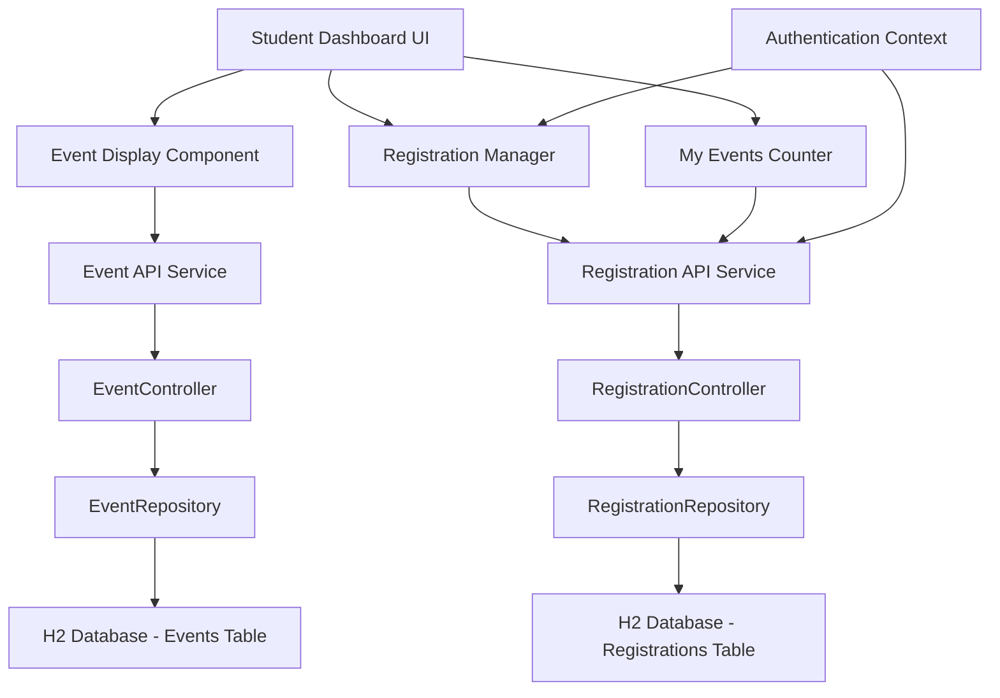

# Design Document

## Overview

This feature enhances the student dashboard by adding the ability to view and register for 12 past events in the browse events section. The design leverages the existing Spring Boot backend with H2 database and extends the current dashboard.html frontend with dynamic JavaScript functionality. Students can register for or cancel registration from events with real-time UI updates, persistent data storage, and comprehensive user feedback.

The solution integrates seamlessly with the existing registration system, utilizing the current `/api/registrations/register` and `/api/registrations/cancel/{userId}/{eventId}` endpoints while adding new frontend components for event display and interaction management.

## Architecture

### System Components



### Data Flow

1. **Page Load**: Dashboard fetches events and user registration status
2. **Event Display**: Renders 12 past events with appropriate button states
3. **Registration Action**: User clicks register/cancel button
4. **API Call**: Frontend sends request to backend with authentication
5. **Database Update**: Backend persists changes via JPA/Hibernate
6. **UI Update**: Frontend updates button state and counter without reload
7. **User Feedback**: Success/error messages displayed to user

### Integration Points

- **Existing Backend**: Utilizes current RegistrationController endpoints
- **Authentication**: Leverages existing session-based student authentication
- **Database**: Extends current H2 database schema usage
- **Frontend**: Enhances existing dashboard.html with new components

## Components and Interfaces

### Frontend Components

#### EventDisplayComponent
**Purpose**: Renders the list of 12 past events in the browse events section

**Responsibilities**:
- Fetch events from `/api/events` endpoint
- Display event details (title, date, description, registration fee)
- Render registration buttons with correct initial state
- Handle event list pagination/filtering to show exactly 12 events

**Interface**:
```javascript
class EventDisplayComponent {
    constructor(containerId, registrationManager)
    async loadEvents()
    renderEventList(events)
    renderEventCard(event, isRegistered)
    updateEventRegistrationState(eventId, isRegistered)
}
```

#### RegistrationManager
**Purpose**: Manages all registration-related operations and state

**Responsibilities**:
- Handle register/cancel button clicks
- Make API calls to registration endpoints
- Manage button states during operations (loading, disabled)
- Coordinate with MyEventsCounter for updates
- Handle authentication context

**Interface**:
```javascript
class RegistrationManager {
    constructor(userId, myEventsCounter, feedbackManager)
    async registerForEvent(eventId, eventTitle)
    async cancelRegistration(eventId, eventTitle)
    async getUserRegistrations()
    isUserRegistered(eventId)
    setButtonLoading(eventId, isLoading)
}
```

#### MyEventsCounter
**Purpose**: Displays and updates the count of registered events

**Responsibilities**:
- Maintain current registration count
- Update count when registrations change
- Sync with backend on page load

**Interface**:
```javascript
class MyEventsCounter {
    constructor(elementId)
    updateCount(newCount)
    increment()
    decrement()
    async syncWithBackend(userId)
}
```

#### FeedbackManager
**Purpose**: Handles user feedback messages for registration actions

**Responsibilities**:
- Display success/error messages
- Auto-clear messages after timeout
- Manage message styling and positioning

**Interface**:
```javascript
class FeedbackManager {
    constructor(containerId)
    showSuccess(message)
    showError(message)
    clearMessages()
    autoHideMessage(delay = 5000)
}
```

### Backend Components

#### Enhanced RegistrationController
**Current Endpoints** (already implemented):
- `POST /api/registrations/register` - Register user for event
- `DELETE /api/registrations/cancel/{userId}/{eventId}` - Cancel registration
- `GET /api/registrations/user/{userId}` - Get user registrations

**Usage Pattern**:
```java
// Registration request body
{
    "userId": 1001,
    "eventId": 5,
    "userName": "Student Name",
    "userEmail": "student@college.edu",
    "paymentMethod": "DESK"
}

// Registration response
{
    "success": true,
    "message": "Registration successful!",
    "registration": { /* registration object */ },
    "eventTitle": "Event Name"
}
```

#### EventController
**Current Endpoints** (already implemented):
- `GET /api/events` - Get all events

**Usage**: Frontend will fetch all events and filter to show 12 past events

### Authentication Integration

The system will integrate with the existing authentication mechanism:

```javascript
// Authentication context retrieval
const authContext = {
    userId: getCurrentUserId(), // From existing auth system
    userName: getCurrentUserName(),
    userEmail: getCurrentUserEmail()
};
```

## Data Models

### Event Model (Existing)
```java
@Entity
public class Event {
    private Long id;
    private String title;
    private String location;
    private String description;
    private String date;
    private String imageUrl;
    private String category;
    private Double registrationFee;
    // ... getters/setters
}
```

### Registration Model (Existing)
```java
@Entity
public class Registration {
    private Long id;
    private Long userId;
    private Long eventId;
    private String userName;
    private String userEmail;
    private String status;
    private String paymentMethod;
    private String paymentStatus;
    private Double registrationFee;
    private LocalDateTime registrationDate;
    // ... getters/setters
}
```

### Frontend Data Structures

#### EventDisplayData
```javascript
const eventDisplayData = {
    id: number,
    title: string,
    date: string,
    description: string,
    location: string,
    registrationFee: number,
    isRegistered: boolean,
    isLoading: boolean
};
```

#### RegistrationState
```javascript
const registrationState = {
    userRegistrations: Set<number>, // Set of event IDs
    totalCount: number,
    isLoading: boolean
};
```

## Correctness Properties

*A property is a characteristic or behavior that should hold true across all valid executions of a system-essentially, a formal statement about what the system should do. Properties serve as the bridge between human-readable specifications and machine-verifiable correctness guarantees.*

Before writing correctness properties, I need to analyze the acceptance criteria to determine which are suitable for property-based testing.
### Property Reflection

After analyzing all acceptance criteria, I identified several redundant properties that can be consolidated:

**Redundancies Identified:**
- Properties 2.1 and 3.1 both test button text based on registration status - can be combined into one comprehensive button state property
- Properties 2.4 and 6.1 both test counter increment - duplicate
- Properties 3.4 and 6.2 both test counter decrement - duplicate  
- Properties 2.5 and 8.2 both test error message display for registration - duplicate
- Properties 3.5 and 8.4 both test error message display for cancellation - duplicate
- Properties 2.3 and 3.3 test button state changes after operations - can be combined with the comprehensive button state property

**Consolidated Properties:**
1. **Button State Consistency** - Combines 2.1, 3.1, 2.3, 3.3, 4.1 into one comprehensive property
2. **Counter Operations** - Combines 2.4, 3.4, 6.1, 6.2 into increment/decrement behavior
3. **Error Handling** - Combines 2.5, 3.5, 8.2, 8.4 into comprehensive error display property
4. **Success Feedback** - Combines 8.1, 8.3 into success message property

### Property 1: Button State Consistency

*For any* event and registration state combination, the registration button text SHALL accurately reflect the current registration status ("Register" when not registered, "Cancel Registration" when registered)

**Validates: Requirements 2.1, 3.1, 2.3, 3.3, 4.1**

### Property 2: Event Display Completeness

*For any* set of events rendered in the display, each event SHALL include all required information fields (title, date, description, registration status)

**Validates: Requirements 1.3**

### Property 3: Event Count Constraint

*For any* collection of available events, the Event_Display SHALL render exactly 12 events regardless of the total number of events available

**Validates: Requirements 1.1**

### Property 4: Counter Operation Consistency

*For any* initial counter value, registration operations SHALL increment the counter by exactly 1 and cancellation operations SHALL decrement the counter by exactly 1

**Validates: Requirements 2.4, 3.4, 6.1, 6.2**

### Property 5: Button State During Operations

*For any* API operation (registration or cancellation), the registration button SHALL be disabled during the operation and re-enabled when the operation completes

**Validates: Requirements 4.4, 4.5**

### Property 6: Error Message Display

*For any* failed registration or cancellation operation, the system SHALL display an error message containing the failure reason

**Validates: Requirements 2.5, 3.5, 8.2, 8.4**

### Property 7: Success Message Display

*For any* successful registration or cancellation operation, the system SHALL display a success message

**Validates: Requirements 8.1, 8.3**

### Property 8: Authentication Context Usage

*For any* registration or cancellation API request, the request SHALL include the authenticated student's user ID

**Validates: Requirements 7.2, 7.3**

### Property 9: UI State Persistence

*For any* database registration state, when the Student_Panel loads, the displayed registration states SHALL match the database state

**Validates: Requirements 5.3, 6.3**

### Property 10: Message Auto-Clear Behavior

*For any* feedback message displayed, the message SHALL be cleared after 5 seconds or when the user performs another action

**Validates: Requirements 8.5**

## Error Handling

### Frontend Error Scenarios

#### Network Errors
- **Connection Timeout**: Display "Connection timeout. Please check your internet connection."
- **Server Unavailable**: Display "Server temporarily unavailable. Please try again later."
- **Network Failure**: Display "Network error occurred. Please check your connection and retry."

#### API Response Errors
- **400 Bad Request**: Display specific error message from server response
- **401 Unauthorized**: Redirect to login page with message "Session expired. Please log in again."
- **403 Forbidden**: Display "You don't have permission to perform this action."
- **404 Not Found**: Display "Event not found. It may have been removed."
- **409 Conflict**: Display "You are already registered for this event."
- **500 Server Error**: Display "Server error occurred. Please try again later."

#### Validation Errors
- **Missing Authentication**: Display "Authentication required. Please log in."
- **Invalid Event ID**: Display "Invalid event selected. Please refresh and try again."
- **Duplicate Registration**: Display "You are already registered for this event."

### Error Recovery Mechanisms

#### Automatic Retry
```javascript
class APIService {
    async makeRequest(url, options, maxRetries = 3) {
        for (let attempt = 1; attempt <= maxRetries; attempt++) {
            try {
                const response = await fetch(url, options);
                if (response.ok) return response;
                if (response.status >= 400 && response.status < 500) {
                    // Client errors - don't retry
                    throw new Error(`HTTP ${response.status}: ${response.statusText}`);
                }
                // Server errors - retry
                if (attempt === maxRetries) {
                    throw new Error(`Server error after ${maxRetries} attempts`);
                }
                await this.delay(1000 * attempt); // Exponential backoff
            } catch (error) {
                if (attempt === maxRetries) throw error;
                await this.delay(1000 * attempt);
            }
        }
    }
}
```

#### State Recovery
- **Button State Reset**: If operation fails, reset button to previous state
- **Counter Rollback**: If registration fails after counter update, rollback counter
- **UI Consistency**: Ensure UI state matches backend state after errors

#### User Guidance
- **Clear Error Messages**: Provide specific, actionable error messages
- **Retry Options**: Offer retry buttons for recoverable errors
- **Help Links**: Provide links to support or troubleshooting guides

## Testing Strategy

### Dual Testing Approach

This feature will use both unit tests and property-based tests for comprehensive coverage:

**Unit Tests** focus on:
- Specific examples and edge cases (empty event lists, specific error responses)
- Integration points between components
- Authentication and session handling
- API endpoint contract verification

**Property-Based Tests** focus on:
- Universal properties across all inputs (button states, counter operations, message display)
- Comprehensive input coverage through randomization
- State consistency verification across various scenarios

### Property-Based Testing Configuration

**Library**: fast-check (JavaScript property-based testing library)
**Minimum Iterations**: 100 per property test
**Test Tagging**: Each property test references its design document property

**Example Property Test Structure**:
```javascript
// Feature: student-past-events-registration, Property 1: Button State Consistency
fc.assert(fc.property(
    fc.record({
        eventId: fc.integer(1, 1000),
        isRegistered: fc.boolean(),
        isLoading: fc.boolean()
    }),
    (testData) => {
        const button = createRegistrationButton(testData.eventId, testData.isRegistered);
        const expectedText = testData.isRegistered ? "Cancel Registration" : "Register";
        expect(button.textContent).toBe(expectedText);
    }
), { numRuns: 100 });
```

### Unit Test Categories

#### Component Integration Tests
- EventDisplayComponent initialization and event loading
- RegistrationManager integration with API services
- MyEventsCounter synchronization with backend
- FeedbackManager message display and clearing

#### API Contract Tests
- Registration endpoint request/response format validation
- Cancellation endpoint parameter validation
- Error response format verification
- Authentication header inclusion

#### Edge Case Tests
- Empty event list handling
- Network timeout scenarios
- Duplicate registration attempts
- Invalid authentication contexts

### Integration Testing

#### Backend Integration
- End-to-end registration flow with real database
- Authentication context integration
- Error handling with actual API responses
- Data persistence verification

#### Frontend Integration
- Component interaction testing
- Event handling and state management
- DOM manipulation verification
- User interaction simulation

### Test Data Management

#### Mock Data Generation
```javascript
const mockEventGenerator = {
    generateEvent: (id) => ({
        id,
        title: `Event ${id}`,
        date: new Date().toISOString(),
        description: `Description for event ${id}`,
        location: `Location ${id}`,
        registrationFee: Math.random() * 200,
        category: 'Academic'
    }),
    
    generateRegistrationState: (userId, eventIds) => 
        eventIds.map(eventId => ({ userId, eventId, isRegistered: Math.random() > 0.5 }))
};
```

#### Test Environment Setup
- H2 in-memory database for integration tests
- Mock authentication context for unit tests
- Stubbed API responses for frontend tests
- Automated test data cleanup between test runs

This comprehensive testing strategy ensures both the correctness of individual components and the overall system behavior across a wide range of scenarios and inputs.