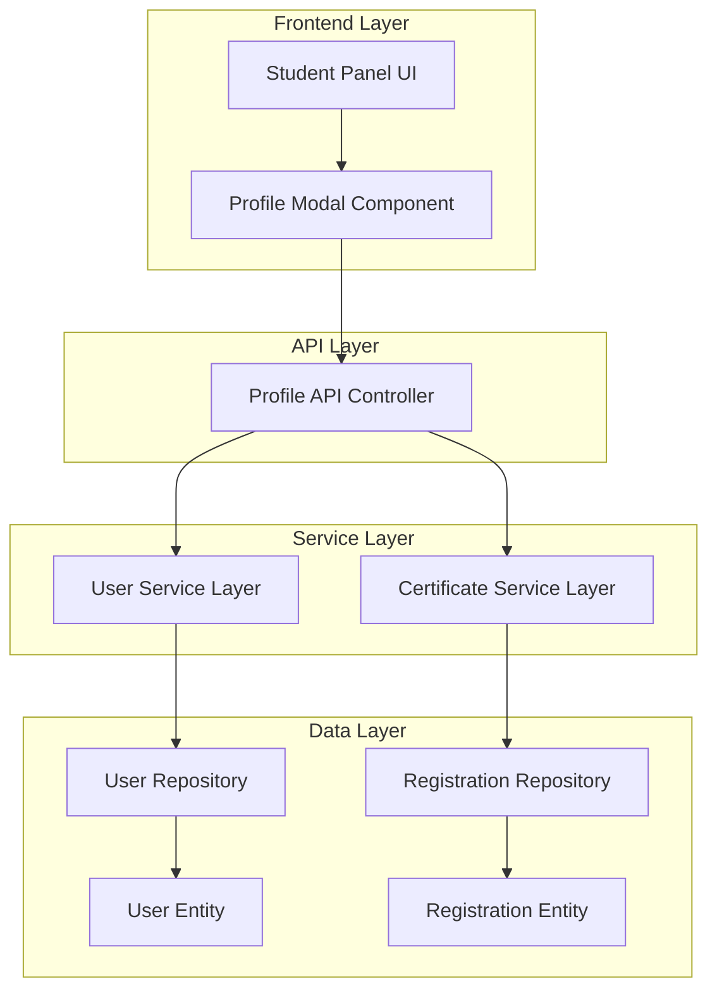

# Design Document: Student Profile Management

## Overview

The Student Profile Management feature extends the existing college event management system by providing students with a comprehensive profile section. This feature integrates seamlessly with the current student panel navigation, leveraging existing authentication and data models while adding new functionality for certificate tracking, password management, and profile editing.

The design follows the established patterns in the system: Spring Boot backend with REST APIs, JPA for data persistence, and a modal-based frontend interface that maintains consistency with the existing student dashboard.

## Architecture

### System Integration Points

The Student Profile Management feature integrates with several existing system components:

- **Authentication System**: Leverages existing session-based authentication and user management
- **Student Panel Navigation**: Adds a new "Profile" navigation item to the existing sidebar
- **Registration System**: Queries existing Registration entities to calculate certificate counts
- **User Management**: Extends existing UserController and User model functionality

### Component Architecture



### Technology Stack Alignment

The feature maintains consistency with the existing technology stack:
- **Backend**: Spring Boot, Spring Data JPA, H2 Database
- **Frontend**: Vanilla JavaScript, HTML5, CSS3 with existing modal patterns
- **Authentication**: Session-based authentication (existing)
- **API Design**: RESTful endpoints following existing controller patterns

## Components and Interfaces

### 1. Frontend Components

#### ProfileModal Component
- **Purpose**: Main UI component for profile management
- **Location**: Integrated into existing dashboard.html
- **Responsibilities**:
  - Display certificate count
  - Handle password change form
  - Manage profile information editing
  - Provide user feedback and validation messages

#### Navigation Integration
- **Purpose**: Add Profile navigation item to student sidebar
- **Implementation**: Extend existing navigation structure in dashboard.html
- **Positioning**: Added to FEATURES section after Certificate navigation item

### 2. Backend Components

#### ProfileController (New)
- **Purpose**: Handle profile-specific API requests
- **Endpoints**:
  - `GET /api/profile/certificates/count/{userId}` - Get certificate count
  - `PUT /api/profile/password` - Change password
  - `PUT /api/profile/info` - Update profile information

#### Enhanced UserController
- **Purpose**: Extend existing functionality for profile management
- **New Methods**:
  - Password validation and updating
  - Profile information updates with validation

#### CertificateService (New)
- **Purpose**: Business logic for certificate counting
- **Responsibilities**:
  - Query registrations with valid certificates
  - Calculate and return certificate counts
  - Handle edge cases and error scenarios

### 3. Data Layer Extensions

#### Registration Repository Enhancement
- **New Query Method**: `countByUserIdAndCertificateIdIsNotNull(Long userId)`
- **Purpose**: Efficiently count certificates for a specific user

#### User Model Validation
- **Enhanced Validation**: Add validation annotations for profile updates
- **Security**: Ensure password hashing consistency

## Data Models

### Existing Models (Referenced)

#### User Entity
```java
@Entity
@Table(name = "users")
public class User {
    @Id
    @GeneratedValue(strategy = GenerationType.IDENTITY)
    private Long id;
    
    @NotBlank(message = "Name is required")
    private String name;
    
    @Email(message = "Valid email is required")
    private String email;
    
    @Size(min = 6, message = "Password must be at least 6 characters")
    private String password;
    
    private String role;
    private String otp;
    
    // Getters and setters...
}
```

#### Registration Entity (Referenced)
```java
@Entity
@Table(name = "registrations")
public class Registration {
    @Id
    @GeneratedValue(strategy = GenerationType.IDENTITY)
    private Long id;
    
    private Long userId;
    private Long eventId;
    private String certificateId; // Key field for certificate counting
    
    // Other fields...
}
```

### New DTOs

#### ProfileInfoDTO
```java
public class ProfileInfoDTO {
    private String name;
    private String email;
    private Integer certificateCount;
    
    // Constructors, getters, setters...
}
```

#### PasswordChangeDTO
```java
public class PasswordChangeDTO {
    @NotBlank(message = "Current password is required")
    private String currentPassword;
    
    @Size(min = 6, message = "New password must be at least 6 characters")
    private String newPassword;
    
    // Constructors, getters, setters...
}
```

## Error Handling

### Frontend Error Handling
- **Validation Errors**: Display inline error messages for form validation
- **Network Errors**: Show user-friendly error messages for API failures
- **Loading States**: Provide visual feedback during API calls

### Backend Error Handling
- **Authentication Errors**: Return 401 for unauthenticated requests
- **Validation Errors**: Return 400 with detailed validation messages
- **Database Errors**: Return 500 with generic error messages (log details server-side)
- **Not Found Errors**: Return 404 for non-existent resources

### Error Response Format
```json
{
    "success": false,
    "message": "User-friendly error message",
    "errors": {
        "field": "Specific field validation error"
    }
}
```

## Testing Strategy

### Dual Testing Approach

**Unit Tests**: Verify specific examples, edge cases, and error conditions
**Property Tests**: Verify universal properties across all inputs using property-based testing
**Integration Tests**: Verify system component interactions and end-to-end workflows

Together these provide comprehensive coverage where unit tests catch concrete bugs, property tests verify general correctness, and integration tests ensure proper system integration.

### Property-Based Testing Implementation

**Testing Framework**: JQwik for Java (property-based testing library)
**Test Configuration**: Minimum 100 iterations per property test
**Property Test Tagging**: Each property test must reference its design document property using the format:
`@Tag("Feature: student-profile-management, Property N: [property description]")`

**Property Test Requirements**:
- Each correctness property must be implemented as a single property-based test
- Tests must generate diverse input data to explore edge cases
- Property tests must be deterministic and repeatable
- All property tests must pass consistently across multiple runs

### Unit Testing Approach

**Backend Unit Tests**:
- **ProfileController Tests**: Test all endpoints with various input scenarios
- **CertificateService Tests**: Test certificate counting logic with different data states  
- **Repository Tests**: Test custom query methods for certificate counting
- **Validation Tests**: Test input validation for password changes and profile updates

**Frontend Unit Tests**:
- **Form Validation Tests**: Test client-side validation logic
- **API Integration Tests**: Test API call handling and error scenarios
- **UI State Tests**: Test modal display and navigation integration

### Integration Testing

**API Integration Tests**:
- **End-to-End Profile Workflow**: Test complete profile management flow
- **Authentication Integration**: Test profile access with different user states
- **Database Integration**: Test certificate counting with real data scenarios

**Frontend Integration Tests**:
- **Navigation Integration**: Test profile access from student panel
- **Modal Integration**: Test profile modal within existing dashboard
- **Responsive Design**: Test profile interface on different screen sizes

### Test Data Requirements

**Certificate Counting Tests**:
- Users with 0 certificates
- Users with multiple certificates
- Users with registrations but no certificates
- Database error scenarios

**Password Management Tests**:
- Valid password changes
- Invalid current password scenarios
- Password validation edge cases
- Concurrent password change attempts

**Profile Management Tests**:
- Valid profile updates
- Empty name validation
- Email display (read-only) verification
- Profile update error scenarios

### Testing Tools and Frameworks

**Backend Testing**:
- **JUnit 5**: Primary testing framework
- **JQwik**: Property-based testing framework for Java
- **Spring Boot Test**: Integration testing support
- **Mockito**: Mocking framework for unit tests
- **TestContainers**: Database integration testing (if needed)

**Frontend Testing**:
- **Manual Testing**: Primary approach for UI validation
- **Browser Testing**: Cross-browser compatibility verification
- **Responsive Testing**: Mobile and tablet interface validation

## Correctness Properties

*A property is a characteristic or behavior that should hold true across all valid executions of a system-essentially, a formal statement about what the system should do. Properties serve as the bridge between human-readable specifications and machine-verifiable correctness guarantees.*

### Property 1: Certificate Count Accuracy

*For any* student user and any set of registrations, the certificate count SHALL equal the number of registrations belonging to that user where certificateId is not null and not empty.

**Validates: Requirements 1.1, 1.2, 1.3**

### Property 2: Certificate Count Display Format

*For any* certificate count value, the display format SHALL use proper pluralization ("1 certificate earned" for count=1, "N certificates earned" for count≠1, "0 certificates earned" for count=0).

**Validates: Requirements 1.4, 1.5**

### Property 3: Password Authentication Requirement

*For any* password change request, the system SHALL require and verify the current password before allowing any password modification, rejecting all requests with incorrect current passwords.

**Validates: Requirements 2.1, 2.2**

### Property 4: Password Validation Consistency

*For any* password input, the validation SHALL consistently enforce minimum length requirements (≥6 characters), rejecting all passwords under 6 characters with appropriate error messages.

**Validates: Requirements 2.3, 2.4**

### Property 5: Password Change Success Behavior

*For any* valid password change request (correct current password + valid new password), the system SHALL update the database and return success confirmation.

**Validates: Requirements 2.5**

### Property 6: Profile Data Display Accuracy

*For any* authenticated student user, the profile display SHALL show their exact current name and email address from the database.

**Validates: Requirements 3.1**

### Property 7: Name Validation Consistency

*For any* name update input, the validation SHALL consistently reject empty or whitespace-only names with appropriate error messages.

**Validates: Requirements 3.4, 3.5**

### Property 8: Profile Update Success Behavior

*For any* valid profile update request (non-empty name), the system SHALL update the database and return success confirmation.

**Validates: Requirements 3.6**

### Property 9: Data Isolation Enforcement

*For any* authenticated student user, the system SHALL only display and allow modification of data (certificates, profile information) belonging to that specific user, never exposing other users' data.

**Validates: Requirements 5.1, 5.2**

### Property 10: Password Hashing Consistency

*For any* password input, the system SHALL consistently hash passwords using the existing password storage method before database storage.

**Validates: Requirements 5.5**

### Property 11: Certificate Count Synchronization

*For any* certificate data changes in the registration system, the certificate count SHALL accurately reflect the updated state upon profile refresh.

**Validates: Requirements 6.3**

### Property 12: Error Message Consistency

*For any* validation error condition, the system SHALL display clear, user-friendly error messages consistently across all profile management operations.

**Validates: Requirements 7.3**

### Test Coverage Goals

- **Backend Code Coverage**: Minimum 80% line coverage
- **Critical Path Coverage**: 100% coverage for authentication and data validation
- **Error Scenario Coverage**: All error handling paths tested
- **Integration Coverage**: All API endpoints tested end-to-end